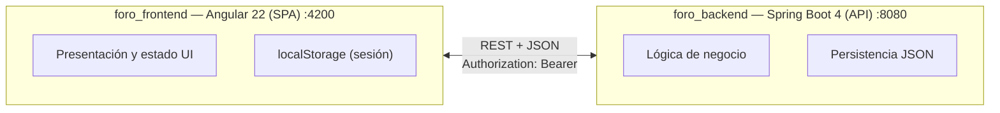
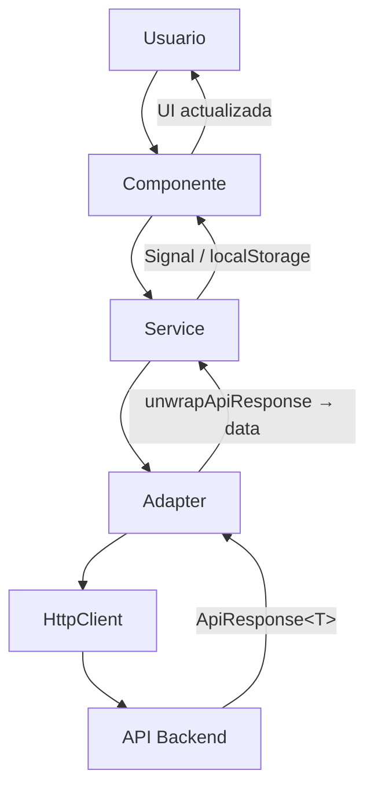
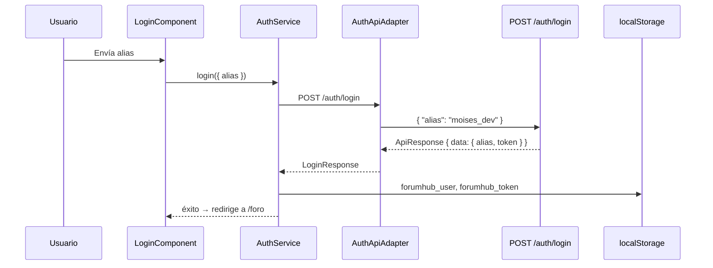
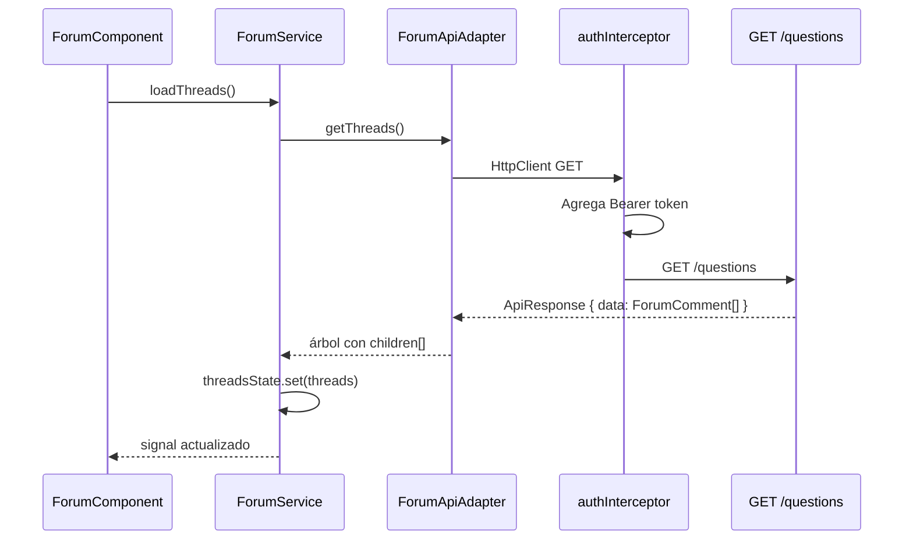
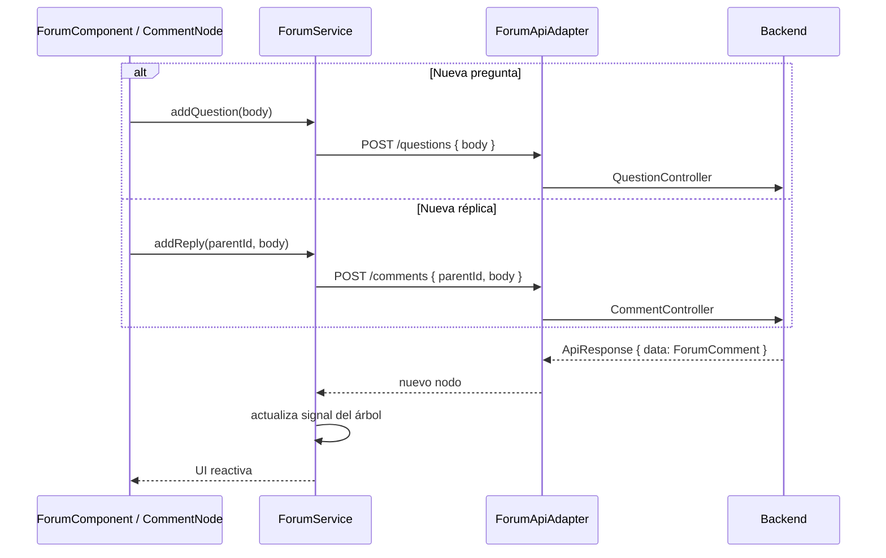
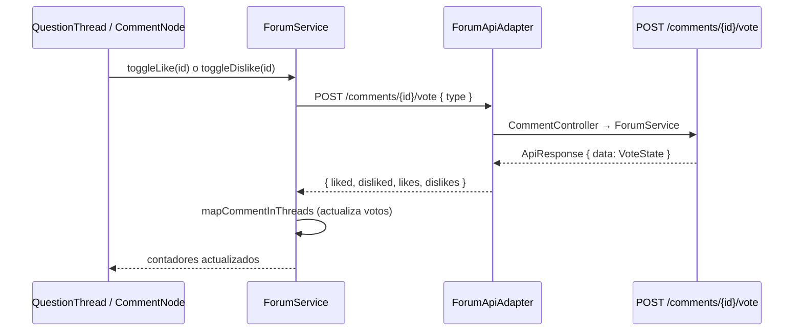

# Uso de IA 

> *Nota: La redacción de este documento, así como la generación de diagramas y árboles de archivos, contó con asistencia de IA y guías para la creación de diagramas.*

## INSTRUCCIONES
[Instrucciones](INSTRUCCIONES.md)
## REPOSITORIOS
### FRONTEND:
https://github.com/MoisesCamacho01/foro_frontend
### BACKEND:
https://github.com/MoisesCamacho01/foro_backend
### DISEÑO DE STITCH:
https://stitch.withgoogle.com/projects/5862655047092008036

## Herramientas utilizadas General

- **Obsidian:** Se utilizó el software Obsidian para llevar un registro de las notas y prompts que se utilizan antes de empezar a definir el diseño y el desarrollo del aplicativo. Uso este software para poder organizarme y de esta forma crear los prompts con mayor exactitud al memento de pasarlo al agente.
- **Stitch:** Utilice Stitch Design IA ** para la generación acelerada de componentes UI, maquetación y prototipado del diseño antes del desarrollo en Angular.
- **MCPs:** Lo utilice para extender el contexto del chat de Cursor conectándola directamente con herramientas externas como: Stitch, Playwright. Esto permite que el modelo en uso analice y manipule las peticiones de la interfaz que yo quiero crear, replicando de 99% el diseño que he creado en Stitch anteriormente, de la misma forma. realizando las pruebas de QA con mayor precisión.
- **Playwright:** Lo utlice para realizar las pruebas de QA permitiendome validar automáticamente el comportamiento funcional de la aplicación, además de capturar y revisar el estado visual de la UI de forma confiable.
- **Cursor:** Lo utilice para acelerar la escritura del código mediante el modelo composer 2.5 ya que es el modelo optimizado para la escritura de código además de que consume menos tokens para realizar una tarea en concreto, a diferencia de otros modelos.
## Herramientas utilizadas (Front-end)
### Framework y lenguaje
- **Angular (22.1.x ) Framework principal:** componentes standalone, routing, forms, HTTP
- **TypeScript(6.0.x):** Tipado estático del dominio (`ForumComment`, `LoginResponse`, etc.) |
- **RxJS(7.8.x):** Flujos asíncronos en servicios, adapters e interceptors |
- **Angular Signals:** Se uso para el estado reactivo del foro (`ForumService.threads`) y UI del login
### UI y estilos
- **Tailwind CSS(4.1.x):** Utilidades de layout, colores y responsive
- **PostCSS(8.5.x):** Pipeline de CSS con plugin `@tailwindcss/postcss`
- **Phosphor Icons(2.1.x):** Iconos de votos (like/dislike), navegación y estados
- **Reactive Forms:** Validación de alias en login y cuerpo de preguntas
### Build y entorno de desarrollo
- **Angular CLI(22.1.x):** Scaffolding, servidor de desarrollo y build de producción
- **@angular/build(22.1.x):** Bundler basado en esbuild (reemplaza Webpack en Angular moderno)
- **pnpm:(11.3.x):** Gestor de dependencias y scripts del proyecto
### Pruebas
- **Vitest(4.0.x):** Runner de tests unitarios integrado con Angular CLI
- **jsdom(28.x)** Entorno DOM simulado para pruebas unitarias |
- **Playwright(1.63.x)** Pruebas E2E de login, foro, réplicas y votos (`e2e/`)

Playwright ejecuta los flujos contra Chromium en `http://localhost:4200`, validando la UI completa antes de integrar cambios al API.
### Calidad de código
- **Prettier:** Formato consistente (comillas simples, ancho 100, parser Angular en HTML)
- **EditorConfig:** Indentación de 2 espacios, UTF-8, fin de línea en todos los archivos
- **TypeScript strict:** 
	- noImplicitReturns
	- strictInjectionParameters
	- strictInputAccessModifiers
### Integración con backend
- **HttpClient:** Peticiones REST desde los adapters
- **authInterceptor:** Inyección automática del token JWT en cada request al API
- **environment.ts:** Configuración de `apiBaseUrl` por entorno

### Herramientas utilizadas (Back-end)
- **Java(17):** Lenguaje base
- **Spring Boot(4.1.x):** Framework web y configuración
- **Maven:** Build y dependencias
- **Jackson:** Serialización JSON
- **JJWT(0.12.6):** Generación y validación de tokens JWT
- **Lombok:** Reducir boilerplate en modelos y servicios
- **Bean Validation:** Validación de DTOs de entrada
- **JUnit / MockMvc:** Pruebas unitarias, de controlador e integración
## Prompts más relevantes. 
Entre los prompts mas relevantes son: 
### Propmts Front-end

#### Interfaz del foro (Prompt para generar las vistas en stitch)
```md
Crea el diseño de una aplicación para realizar comentarios de foro esta pagina tiene que tener lo siguiente:

# Reglas base
- background #FCFCFC
- foreground #242424
- background-card #FFFFFF
- primary color #4F9AFF
- secundary color #5BFF4F
- danger color #D60F1C
- info color #14D9E0
- warning #EDE702
- shadow #F2F2F2

# Vista de login
- Crea una vista con un Card en el centro
- Agrega un Label dentro del Card con el texto "Ingresa un nombre de usuario"
- Agrega un input dentro del Card
- Dentro del input un placeholder con el texto Ingrese nombre de usuario
- Agrega un botón con el texto "Acceder al foro"

# Vista del foro
- Crea una vista con dos card principales una encima de otra 
- En la primera card agrega un textarea con el id="text-question", también agrega un botón con el id="add_question"
- En la segunda card agrega la pregunta con las respuestas respectivamente
- Las respuestas tienen que tener jerarquía en forma de escalera
- Las preguntas y las respuestas tienen que tener las siguientes opciones
	- Elegir me gusta
	- Elegir no me gusta
	- Replicar a la pregunta y a los comentarios que tenga esta pregunta
	- Tiene que tener un contador
- Cuando se da clic en el botón me gusta y si la opción no me gusta esta marcada se tiene que desmarcar  la opción no me gusta y marcar la opción me gusta.
- Si se da clic en la opción me gusta y esta esta marcada se tiene que desmarcar
- Cuando se da clic en el botón no me gusta y si la opción me gusta esta marcada se tiene que desmarcar la opción me gusta y marcar la opción no me gusta.
- Si se da clic en la opción me gusta y esta esta marcada se tiene que desmarcar
- Cuando se de clic en Replicar tiene que desplegar un input debajo de la opción replicar el input desplegado tendrá el siguiente id="reply" y un placeholder que diga "agregar replica"
- Al lado derecho del input "reply" agrega un botón con el id="add_reply"
- Cuando se agregue el reply ocultar el input "reply" y el boton "add_reply"
  
# Prompts adicionales en stitch
- Separa la vista login en una nueva ventana
- Separa la vista de los comentarios
- agrega la card para agregar preguntas
- Separa el contador de puntaje en dos conteos "me gusta" y "no me gusta"
```

#### Reglas que tiene que seguir cursor para desarrollar en Angular
```md
---
description: Reglas generales para el proyecto foro_frontend.mdc
alwaysApply: true
---


# Reglas del proyecto
- Usar typescript
- Usar tipado estricto siempre que sea posible.
- Utiliza documentacion para la vercion 22.1.8 de angular cli
- Utiliza buenas practicas de estructura de carpetas para proyectos en angular
- Utiliza las mejores practicas de codigo limpio
- Utiliza @src/ para importar los modulos o componentes

# Reglas del diseño
- Utiliza el mcp de stitch para realizar el diseño de interfaces
- El diseño en angular tiene que ser igual al diseño que esta en stitch
- Usar tailwind para el diseño
- Utilizar buenas practicas de diseño front-end
- No intentes levantar el proyecto ya que el proyecto ya esta corriendo por este puerto 4200
- Si necesitas borrar cache apaga el proyecto en el puerto 4200 y ejecuta el comando "pnpm start"
- para ejecutar el proyecto tienes que hacerlo con este comando "pnpm dev"
- si stitch no esta disponible para el proceso

# Reglas para realizar commits
- Nunca realices "git add ." en cambio usa git add nombre_del_ficher
- El commit tiene que ser claro y en español
- Utiliza los prefijos de git para subir los commits:
    - feat: Una nueva característica para el usuario.
    - fix: Arregla un bug que afecta al usuario.
    - perf: Cambios que mejoran el rendimiento del sitio.
    - build: Cambios en el sistema de build, tareas de despliegue o instalación.
    - ci: Cambios en la integración continua.
    - docs: Cambios en la documentación.
    - refactor: Refactorización del código como cambios de nombre de variables o funciones.
    - style: Cambios de formato, tabulaciones, espacios o puntos y coma, etc; no afectan al usuario.
    - test: Añade tests o refactoriza uno existente.
      
# Reglas para realizar pruebas de QA
- Utiliza el mcp Playwright para realizar pruebas
- las pruebas de QA tambien tienen que comparar el diseño con stitch
- Todas las pruebas de QA se deben guardar en un resumen dentro de la carpeta /documentation
- Se estricto con las pruebas de QA
- Si la prueba de QA no son satisfactorias vuelve a analizar la propuesta en stitch y realiza las correcciones necesarias.

# Reglas de documentacion frontend
- Realiza la documentacion una vez que las pruebas de QA finalizaran satisfactoriamente
- Todos los cambios que se realicen en el proyecto tiene que estar documentados en la carpeta documentation/{idCommit} con el siguiente formato idCommit_fecha.md
- Los documentos creados tienen que tener diagramas explicativos del proceso y ajustes que se realizaron

# Reglas para crear las tareas
- Analiza la propuesta grafica antes de empezar a desarrollar
- Separa la propuesta en pequeñas tareas realizables
- Crea todas las tareas en la carpeta /task/
- Ordena las tareas por dificultad
```

#### Prompts para crear las vistas en Angular
```md
# Crear la vista de login
- Utiliza stich y abre el Abre el proyecto "Aplicación Foro Comentarios Interactivos "
- Analiza la vista "Vista de Login - Foro de Comentarios" 
- Crea las tareas correspondientes para copiar esta vista

# Crear la vista del foro
- Utiliza stich y abre el Abre el proyecto "Aplicación Foro Comentarios Interactivos "
- Analiza la vista "Vista de Comentarios y Discusión - ForumHub" 
- Crea las tareas correspondientes para copiar esta vista

# Correcciones
- Has que el botón "Publicar Pregunta" cree una nueva card con la pregunta a publicar
```
#### Prompts para crear los contratos del frontend
```md
- Crea un documento md explicando sobre los request que se enviarian al servicio
- Este documento tiene que explicar el flujo que esta realizando actualmente el frontend
```
#### Prompts para consumir el backend
```md
- crea un adaptadores para consumir los endpoints de la siguiente ruta 
  http://192.168.18.16/
- crea un archivo de configuración para cambiar la ruta de los endpoints
- El contrato esta en el archivo api-request-flujo.md
```

### Prompts Back-end
#### Reglas del proyecto en JAVA
```md
---
description: Reglas de Cursor para desarrollo backend en Java Spring Boot con persistencia JSON para Forobackend.
alwaysApply: true
---

# Rol de la IA:
- Eres un desarrollador Java Senior experimentado. Siempre te adhieres a los principios SOLID, DRY, KISS y YAGNI.
- Siempre sigues las mejores prácticas de OWASP. Siempre divides las tareas en las unidades más pequeñas posibles y abordas la resolución de cualquier tarea paso a paso.

# Stack tecnológico:
- Framework: Java Spring Boot 4.1.x con Maven y Java 26.0.x
- Dependencias: Spring Web, Lombok, Jackson Databind, Validation (Hibernate Validator).
- Persistencia: Almacenamiento basado en archivos JSON locales (lectura y escritura mediante ObjectMapper), omitiendo controladores de vistas (Thymeleaf) y conectores de BD relacionales.

# Diseño de la lógica de la aplicación:
- Todo el manejo de peticiones y respuestas debe realizarse únicamente en los `@RestController`.
- Toda la lógica de negocio y las operaciones de lectura/escritura en archivos JSON debe residir en las clases `@Service` (o sus implementaciones `ServiceImpl`), las cuales utilizarán componentes dedicados a la manipulación de archivos (`JsonRepository` o `FileDAO`).

- Los `@RestController` deben depender únicamente de las interfaces de servicio (`Service`) y nunca acceder o inyectar directamente la capa de manipulación de archivos JSON ni el `ObjectMapper`.
- Las clases `ServiceImpl` deben delegar la lectura, deserialización, serialización y escritura física de los archivos JSON a componentes o repositorios especializados en archivos.

- El intercambio de datos entre los `@RestController` y las clases `ServiceImpl` (y viceversa) debe realizarse únicamente mediante DTOs (Data Transfer Objects).
- Los modelos o clases que mapean directamente la estructura interna de los archivos JSON (`Models`) no deben exponerse hacia el exterior (cliente API) ni usarse en la capa de controlador.

# Modelos (Estructura de Datos JSON):
- Las clases de modelo representarán la estructura POJO plana correspondiente a la forma del archivo JSON.
- Las clases deben estar anotadas con `@Data` (o `@Getter`, `@Setter`, `@AllArgsConstructor`, `@NoArgsConstructor`).
- El campo identificador debe ser un `String` (UUID v4) generado programáticamente antes de guardar.
- Para el modelado de preguntas y respuestas en cascada/árbol (jerarquía de réplicas), el modelo de respuesta debe almacenar un `parentId` (`String`, opcional/nullable) que apunte al ID de la pregunta o respuesta padre.
- Para las reacciones (votos), el modelo debe incluir contadores explícitos: `likesCount` y `dislikesCount`.
- Se deben utilizar anotaciones de Jackson cuando el esquema JSON lo requiera (p. ej., `@JsonProperty("nombre_campo")`, `@JsonInclude(JsonInclude.Include.NON_NULL)`).

# Repositorio (DAO - Archivos JSON):
- Las clases o implementaciones de repositorio deben estar anotadas con `@Repository`.
- El repositorio debe definirse como una interfaz y su correspondiente clase de implementación (`FooRepository` y `JsonFooRepository`).
- Las clases de repositorio deben utilizar `ObjectMapper` de Jackson junto con la API de archivos de Java (`java.nio.file.Path` / `Files`) para realizar operaciones en los archivos `.json` locales.
- Deben gestionar la concurrencia mediante `ReentrantReadWriteLock` o métodos sincronizados para garantizar escrituras thread-safe.
- El repositorio debe capturar las excepciones `IOException` de Jackson/Java y relanzarlas como excepciones personalizadas de tiempo de ejecución (`PersistenceException`).

# Servicio:
- Las clases de servicio deben definirse estrictamente como interfaces.
- Todas las implementaciones de la lógica de negocio deben residir en clases `ServiceImpl` anotadas con `@Service`.
- Las dependencias deben inyectarse mediante constructor utilizando Lombok (`@RequiredArgsConstructor` con campos `private final`).
- Los valores devueltos por los métodos de `ServiceImpl` deben ser DTOs.
- **Construcción del Árbol de Respuestas:** El servicio debe transformar la lista plana de réplicas con `parentId` en una estructura anidada de DTOs (`List<CommentResponseDTO> replies`) para la visualización escalonada en el frontend.
- Para operaciones atómicas como la incrementación de votos (`like`/`dislike`), el servicio debe coordinar el bloqueo en el repositorio antes de reescribir el archivo JSON.

# Objeto de Transferencia de Datos (DTO):

- Todos los DTOs deben definirse utilizando `record` de Java.
- Deben incluir un constructor compacto para validaciones defensivas inmediatas.
- Se deben incluir anotaciones de Bean Validation (`@NotNull`, `@NotBlank`, `@Size`) sobre los componentes del `record`.
- Para DTOs de salida con jerarquía de réplicas, el `record` de respuesta debe incluir el campo `List<CommentResponseDTO> replies` para enviar el árbol completo estructurado al cliente.

# RestController y CORS:
- Las clases controladoras deben estar anotadas con `@RestController` y `@CrossOrigin(origins = "*")`.
- Inyección de dependencias mediante constructor (`@RequiredArgsConstructor`).
- Retornos unificados con `ResponseEntity<ApiResponse<T>>`.
- Validación de entradas con `@Valid` y `@RequestBody`.
- Sin bloques `try-catch` internos en los métodos (delegado a `@RestControllerAdvice`).

# Estructura de Clases Globales:

- Clase `ApiResponse<T>`:

	```Java
	
	package com.forumhub.dto;
	import com.fasterxml.jackson.annotation.JsonInclude;
	import lombok.AllArgsConstructor;
	import lombok.Builder;
	import lombok.Data;
	import lombok.NoArgsConstructor;
	import java.time.LocalDateTime;
	
	@Data
	@Builder
	@NoArgsConstructor
	@AllArgsConstructor
	@JsonInclude(JsonInclude.Include.NON_NULL)
	public class ApiResponse<T> {
	
	    private String result;          // "SUCCESS" o "ERROR"
	    private String message;         // Mensaje descriptivo
	    private T data;                 // Objeto DTO o colección
	    private LocalDateTime timestamp;// Fecha y hora de respuesta
	  
	    public static <T> ApiResponse<T> success(String message, T data) {
	        return ApiResponse.<T>builder()
	                .result("SUCCESS")
	                .message(message)
	                .data(data)
	                .timestamp(LocalDateTime.now())
	                .build();
	    }
	
	    public static <T> ApiResponse<T> error(String message) {
	        return ApiResponse.<T>builder()
	                .result("ERROR")
	                .message(message)
	                .data(null)
	                .timestamp(LocalDateTime.now())
	                .build();
	    }
	}
	
	```

- Clase GlobalExceptionHandler (/GlobalExceptionHandler.java)

	```Java
	
	package com.forumhub.exception;
	import com.forumhub.dto.ApiResponse;
	import org.springframework.http.HttpStatus;
	import org.springframework.http.ResponseEntity;
	import org.springframework.web.bind.MethodArgumentNotValidException;
	import org.springframework.web.bind.annotation.ExceptionHandler;
	import org.springframework.web.bind.annotation.RestControllerAdvice;
	import java.util.stream.Collectors;
	
	@RestControllerAdvice
	public class GlobalExceptionHandler {
	
	    public static ResponseEntity<ApiResponse<?>> errorResponseEntity(String message, HttpStatus status) {
	        ApiResponse<?> response = ApiResponse.error(message);
	        return new ResponseEntity<>(response, status);
	    }
	
	    @ExceptionHandler(MethodArgumentNotValidException.class)
	    public ResponseEntity<ApiResponse<?>> handleValidationException(MethodArgumentNotValidException ex) {
	        String errors = ex.getBindingResult().getFieldErrors().stream()
	                .map(error -> error.getField() + ": " + error.getDefaultMessage())
	                .collect(Collectors.joining(", "));
	        return errorResponseEntity("Error de validación: " + errors, HttpStatus.BAD_REQUEST);
	    }
	
	    @ExceptionHandler(IllegalArgumentException.class)
	    public ResponseEntity<ApiResponse<?>> handleIllegalArgumentException(IllegalArgumentException ex) {
	        return errorResponseEntity(ex.getMessage(), HttpStatus.BAD_REQUEST);
	    }
	
	    @ExceptionHandler(ResourceNotFoundException.class)
	    public ResponseEntity<ApiResponse<?>> handleResourceNotFoundException(ResourceNotFoundException ex) {
	        return errorResponseEntity(ex.getMessage(), HttpStatus.NOT_FOUND);
	    }
	
	    @ExceptionHandler(Exception.class)
	    public ResponseEntity<ApiResponse<?>> handleGenericException(Exception ex) {
	
	        return errorResponseEntity("Ocurrió un error interno en el servidor: " + ex.getMessage(), HttpStatus.INTERNAL_SERVER_ERROR);
	    }
	}
	
	```

# Reglas para realizar commits

- Nunca realices "git add ." en cambio usa git add nombre_del_ficher
- El commit tiene que ser claro y en español
- Utiliza los prefijos de git para subir los commits:
    - feat: Una nueva característica para el usuario.
    - fix: Arregla un bug que afecta al usuario.
    - perf: Cambios que mejoran el rendimiento del sitio.
    - build: Cambios en el sistema de build, tareas de despliegue o instalación.
    - ci: Cambios en la integración continua.
    - docs: Cambios en la documentación.
    - refactor: Refactorización del código como cambios de nombre de variables o funciones.
    - style: Cambios de formato, tabulaciones, espacios o puntos y coma, etc; no afectan al usuario.
    - test: Añade tests o refactoriza uno existente.

# Reglas para realizar pruebas de QA (Backend API REST):
- Utiliza **JUnit 5**, **MockMvc** y **REST Assured** (o un servidor local ejecutable) para realizar pruebas funcionales de los `@RestController`.
- Utiliza cURL o colecciones automatizadas (como Postman/Hoppscotch) si se requiere validación manual o de integración E2E.
- En lugar de comparar diseños visuales (Stitch), las pruebas de QA deben **validar estrictamente el contrato del JSON de respuesta** (`ApiResponse<T>`) frente a los DTOs definidos de tipo `record`.
- Verifica que los códigos de estado HTTP (`200 OK`, `201 Created`, `400 Bad Request`, `404 Not Found`, `500 Internal Server Error`) coincidan exactamente con la especificación.
- Toda prueba de integración debe validar que la lectura, actualización y escritura en el archivo `.json` de prueba local se refleje de manera correcta y atómica en el disco.
- Realiza pruebas de estrés o hilos concurrentes simulados para verificar que los bloqueos (`ReentrantReadWriteLock`) en los repositorios eviten corrupción de datos.
- Todas las ejecuciones de pruebas de QA y sus resultados deben guardarse en un reporte detallado en formato Markdown dentro de la carpeta `/documentation` (p. ej., `/documentation/qa-test-results.md`).
- Se estricto con las pruebas de QA: una respuesta con estructura JSON incorrecta, tipos de datos no coincidentes, o falla en la manipulación del archivo local se considerará una prueba fallida.
- Si las pruebas de QA no son satisfactorias, vuelve a analizar la regla del módulo, corrige la implementación en la capa correspondiente (`Controller`, `Service` o `Repository`) y reejecuta la suite de pruebas hasta lograr el 100% de éxito.

# Reglas de documentacion backend
- Realiza la documentacion una vez que las pruebas de QA finalizaran satisfactoriamente
- Todos los cambios que se realicen en el proyecto tiene que estar documentados en la carpeta documentation/{idCommit} con el siguiente formato idCommit_fecha.md
- Los documentos creados tienen que tener diagramas explicativos del proceso y ajustes que se realizaron

# Reglas para crear las tareas
- Analiza la propuesta grafica antes de empezar a desarrollar
- Separa la propuesta en pequeñas tareas realizables
- Crea todas las tareas en la carpeta /task/
- Ordena las tareas por dificultad
  
```


#### Prompt para iniciar el desarrollo de los endpoints
```md
- lee el flujo del frontend los request y response que espera esta informacion esta en el archivo documentation/api-request-flujo.md
- crear las tareas correspondientes para llevar acabo los endpoints que esperaria el frontend
- Manten  `ApiResponse<T>`
- Registro Automático ("Get or Create")
- Stateless Simple (Eliminación en Cliente)
```
## Aprendizajes obtenidos. 

En esta prueba tecnica se aprende que el desarrollo con IA es mas efectivo cuando no se utliza como un simple generador de codigo, si no como un asistente guiado, mediante directrices claras. Establecer reglas reduce drásticamente las interacciones innecesarias con el agente. Integrar herramientas como MCPs permite al Agente comprender la arquitectura global del proyecto, de esta forma evitando respuestas vagas por parte del Agente.

La combinación de desarrollo asistido con pruebas automatizadas permite validar de forma ágil que los cambios funcionales  no rompan la experiencia de usuario. Además la supervisión humana sigue siendo indispensable para garantizar el rendimiento y la mantenibilidad del producto final.

Separar las capas (Controller → Service → Repository) en el back-end facilita cambiar la persistencia sin tocar la lógica de negocio. Ademas persistir en JSON con `ReentrantReadWriteLock` permite concurrencia básica sin instalar una base de datos.Usar DTOs (`record`) distintos de los modelos internos evita exponer la estructura de los archivos al cliente.
Un envoltorio uniforme (`ApiResponse<T>`) simplifica el manejo de respuestas en el frontend. también se transformo una lista plana con `parentId` a un árbol anidado lo cual hace que sea un patrón reutilizable para hilos de comentarios.
# Explicación de la solución 

Este aplicativo permite acceder con un **alias** (sin contraseña), publicar preguntas y responder en hilos anidados con votos like/dislike mutuamente exclusivos.

**Explicación del flujo en el front-end:**
1. El usuario ingresa su alias en `/login` → `AuthService` persiste sesión en `localStorage`.
2. Tras autenticarse, navega a `/foro` → `authGuard` valida la sesión local.
3. `ForumComponent` carga los hilos desde el API y muestra cada pregunta con `QuestionThreadComponent`.
4. Las réplicas se insertan en el árbol mediante `CommentNodeComponent` (recursivo).
5. Cada acción (pregunta, réplica, voto) pasa por `ForumService`, que actualiza el estado y delega la petición HTTP al adapter.

**Explicación del flujo en el back-end:**
1. El usuario hace login con un alias → el sistema lo busca o lo crea y devuelve un JWT.
2. Las peticiones al foro llevan el token en `Authorization: Bearer <token>`.
3. Las preguntas y respuestas se guardan como lista plana en `comments.json` (campo `parentId`).
4. Al consultar, el servicio arma un árbol de respuestas anidadas para el frontend.
5. Los votos se registran en `votes.json` y actualizan contadores en los comentarios.

**Endpoints:**

| Método | Ruta | Descripción |
|--------|------|-------------|
| `POST` | `/auth/login` | Login / registro automático por alias |
| `POST` | `/auth/logout` | Cierre de sesión (stateless) |
| `GET` | `/questions` | Listado de preguntas con respuestas en árbol |
| `POST` | `/questions` | Crear pregunta |
| `POST` | `/comments` | Crear respuesta o réplica |
| `POST` | `/comments/{id}/vote` | Votar (like/dislike) |

## Arquitectura. 
Este proyecto se divide en **dos servicios independientes** que se comunican por HTTP. Cada uno tiene su propio repositorio, ciclo de despliegue y responsabilidad clara.

>💡 **Nota de documentación:** Los diagramas de flujo y secuencia presentados a continuación fueron modelados con asistencia de IA.


| Servicio | Tecnología | Puerto | Responsabilidad |
|----------|------------|--------|-----------------|
| **foro_frontend** | Angular 22 | `4200` | UI, formularios, estado reactivo, guards de ruta |
| **foro_backend** | Spring Boot 4 | `8080` | Autenticación JWT, CRUD de preguntas/réplicas, votos |
### Dominios del backend

El backend es un **monolito modular** con dos dominios bien separados por capas. Esto permite evolucionar cada dominio sin afectar al frontend:

| Dominio | Controller | Service | Persistencia |
|---------|------------|---------|--------------|
| **Auth** | `AuthController` | `AuthService` | `data/users.json` |
| **Foro** | `QuestionController`, `CommentController` | `ForumService` | `data/comments.json`, `data/votes.json` |
### ¿Por qué separar frontend y backend?
1. **Desacoplamiento:** el frontend solo conoce el contrato REST (`ApiResponse<T>`), no la implementación interna del servidor.
2. **Despliegue independiente:** se puede actualizar la UI sin tocar el API, o cambiar la persistencia del backend sin reescribir Angular.
3. **Especialización por capa:** Angular maneja reactividad y UX; Spring Boot maneja reglas de negocio, JWT y almacenamiento.
4. **Contrato estable:** ambos equipos (o fases del proyecto) avanzan en paralelo definiendo endpoints y DTOs compartidos.
### Contrato de comunicación
Todas las respuestas del backend usan el mismo envoltorio:

```json
{
  "result": "SUCCESS",
  "message": "Descripción",
  "data": { },
  "timestamp": "2026-09-13T18:30:00"
}
```

El frontend extrae `data` con el operador `unwrapApiResponse()` en los adapters. Si `result !== "SUCCESS"`, se lanza un error.
  
**Autenticación:** JWT stateless. Tras el login, el token se guarda en `localStorage` (`forumhub_token`) y el interceptor lo adjunta automáticamente:

```http
Authorization: Bearer <token>
```

**Configuración de conexión** (`environment.ts`):

```typescript
apiBaseUrl: 'http://192.168.18.16:8080'
```
### Arquitectura Front-end

#### Estructura de carpetas

```
src/app/
├── core/                    # Infraestructura compartida
│   ├── adapters/            # Comunicación HTTP con el backend
│   ├── config/              # Base URL y endpoints
│   ├── guards/              # Protección de rutas
│   ├── interceptors/        # Token JWT en cada request
│   ├── models/              # Tipos y helpers del dominio
│   ├── services/            # Lógica de negocio y estado
│   └── utils/               # Operadores RxJS reutilizables
└── features/                # Vistas por dominio
    ├── auth/login/          # Pantalla de acceso
    └── forum/               # Foro, hilos y comentarios
```

#### Capas y responsabilidades

| Capa                      | Rol                                      | Ejemplo                                |
| ------------------------- | ---------------------------------------- | -------------------------------------- |
| **Features**              | UI, formularios, interacción del usuario | `LoginComponent`, `ForumComponent`     |
| **Services**              | Reglas de negocio, estado, orquestación  | `AuthService`, `ForumService`          |
| **Adapters**              | Peticiones HTTP, mapeo de respuestas     | `AuthApiAdapter`, `ForumApiAdapter`    |
| **Models**                | Tipos del dominio y funciones puras      | `ForumComment`, `appendReplyInThreads` |
| **Guards / Interceptors** | Seguridad transversal                    | `authGuard`, `authInterceptor`         |
#### ¿Por qué esta arquitectura?

1. **Core vs Features:** separa lo que cambia poco (auth, HTTP, modelos) de lo que cambia según la pantalla (login, foro). Facilita ubicar código y escalar con nuevas vistas sin contaminar la infraestructura.
2. **Patrón Adapter:** los servicios no conocen URLs ni formato de respuesta del API. Si el backend cambia contrato o base URL, solo se modifican `adapters/` y `config/`. Los componentes siguen llamando `forumService.addReply()` sin enterarse.
3. **Servicios como fuente de verdad:** `ForumService` concentra el árbol de hilos en un signal. Cualquier componente (pregunta, réplica, voto) lee y muta el mismo estado, evitando inconsistencias en un árbol profundo.
4. **Guards e interceptors desacoplados:** la protección de rutas y el envío del token JWT viven fuera de los componentes. Se aplica de forma uniforme sin repetir `if (!token)` en cada vista.
5. **Standalone + lazy loading:** cada ruta carga su componente bajo demanda (`loadComponent`). Reduce el bundle inicial y sigue las prácticas actuales de Angular 22.
6. **Componente recursivo para el árbol:** las réplicas anidadas son estructuralmente un árbol. Un `CommentNodeComponent` que se auto-importa modela cualquier profundidad con el mismo código, en lugar de crear componentes por nivel.
7. **Funciones puras en modelos:** operaciones como `appendReplyInThreads` y `mapCommentInThreads` son testeables sin Angular ni HTTP, lo que simplifica la lógica del árbol de comentarios.
### Arquitectura back-end

Para la arquitectura del backend adoptó una **arquitectura en capas** sobre Spring Boot, sin base de datos relacional.

```

Cliente (Angular)
       ↓ HTTP + JWT
┌──────────────────┐
│   Controller     │  Recibe peticiones, valida DTOs, devuelve ApiResponse
├──────────────────┤
│   Service        │  Lógica de negocio (login, árbol, votos)
├──────────────────┤
│   Repository     │  Lectura/escritura thread-safe en archivos JSON
└──────────────────┘
       ↓
  data/*.json

```

#### Estructura de Carpetas

```

foro_backend/
├── data/                       # Persistencia en runtime (generado al usar la app)
│   ├── users.json
│   ├── comments.json
│   └── votes.json
├── documentation/              # Decisiones, API y resultados QA
├── src/
│   ├── main/
│   │   ├── java/com/example/foro_backend/
│   │   │   ├── config/         # CORS, JWT, propiedades, seed
│   │   │   ├── controller/     # Endpoints REST
│   │   │   ├── dto/            # Contratos de entrada/salida
│   │   │   │   ├── auth/
│   │   │   │   └── forum/
│   │   │   ├── exception/      # Excepciones y manejo global
│   │   │   ├── mapper/         # Model → DTO, árbol de comentarios
│   │   │   ├── model/          # Estructura interna de los JSON
│   │   │   ├── repository/     # Interfaces de persistencia
│   │   │   │   └── impl/       # Implementaciones JSON
│   │   │   ├── security/       # Contexto del usuario autenticado
│   │   │   ├── service/        # Lógica de negocio
│   │   │   │   └── impl/
│   │   │   ├── util/           # Helpers de presentación
│   │   │   └── ForoBackendApplication.java
│   │   └── resources/
│   │       ├── application.properties
│   │       └── seed/comments.json # Datos iniciales
│   └── test/java/com/example/foro_backend/
│       ├── controller/            # Pruebas de endpoints
│       ├── integration/           # Pruebas de persistencia
│       └── service/               # Pruebas unitarias y concurrencia
├── task/                          # Plan de implementación por tareas
├── pom.xml
├── mvnw
└── README2.md

```

#### Por qué esta arquitectura

1. **Capas separadas:** Cada capa tiene una responsabilidad clara (SOLID). El controlador no conoce archivos; el repositorio no conoce HTTP.
2. **Persistencia JSON:** El proyecto no requiere escalabilidad ni consultas complejas. JSON elimina dependencias externas (PostgreSQL, Docker) y acelera el desarrollo y las pruebas locales.
3. **Interfaces Service/Repository:** Permite sustituir la implementación (por ejemplo, migrar a JPA) sin reescribir controladores ni reglas de negocio.
4. **DTOs distintos de Models:** Los modelos reflejan el archivo JSON; los DTOs reflejan el contrato API. Así el almacenamiento puede cambiar sin romper el frontend.
5. **JWT + interceptor:** Autenticación stateless sin sesiones en servidor ni blacklist de tokens. Adecuado para una API REST consumida por SPA.
6. **Login Get or Create:** Un solo endpoint cubre registro e inicio de sesión, alineado con la UX del frontend (solo se pide alias).
7. **`ApiResponse<T>` uniforme:** Respuestas predecibles (`result`, `message`, `data`, `timestamp`) que el cliente Angular puede procesar de forma genérica.
8. **GlobalExceptionHandler:** Errores centralizados; los controladores quedan limpios y el cliente recibe mensajes consistentes.

## Componentes. 
### Componentes del front-end
#### Rutas

| Ruta     | Guard        | Componente       | Descripción                                      |
| -------- | ------------ | ---------------- | ------------------------------------------------ |
| `/login` | `guestGuard` | `LoginComponent` | Acceso por alias con estados de UI               |
| `/foro`  | `authGuard`  | `ForumComponent` | Listado de preguntas y formulario de publicación |
| `/`      | —            | —                | Redirige a `/login`                              |
#### Features

| Componente                | Responsabilidad                                                                                 |
| ------------------------- | ----------------------------------------------------------------------------------------------- |
| `LoginComponent`          | Formulario reactivo de alias, estados `idle/loading/success/error`, redirección a `/foro`       |
| `ForumComponent`          | Carga hilos, muestra formulario de nueva pregunta, renderiza lista de `QuestionThreadComponent` |
| `QuestionThreadComponent` | Card de pregunta raíz, réplicas directas, votos like/dislike                                    |
| `CommentNodeComponent`    | Réplica anidada (recursivo), sub-réplicas, votos                                                |
#### Core  
| Módulo           | Archivos clave                                | Responsabilidad                                                  |
| ---------------- | --------------------------------------------- | ---------------------------------------------------------------- |
| **Services**     | `auth.service.ts`, `forum.service.ts`         | Sesión, CRUD de hilos, votos, estado reactivo                    |
| **Adapters**     | `auth-api.adapter.ts`, `forum-api.adapter.ts` | `POST /auth/login`, `GET /questions`, `POST /comments`, votos    |
| **Guards**       | `auth.guard.ts`, `guest.guard.ts`             | Bloquear `/foro` sin sesión; bloquear `/login` con sesión activa |
| **Interceptors** | `auth.interceptor.ts`                         | Adjuntar `Authorization: Bearer <token>` a requests al API       |
| **Models**       | `forum.model.ts`, `auth.model.ts`             | Tipos `ForumComment`, `VoteState`, helpers del árbol             |
| **Config**       | `api.config.ts`, `api-endpoints.ts`           | Base URL desde `environment.ts`, rutas del API                   |
### Componentes del Back-end
#### Config (`config/`)

| Clase                         | Función                            |
| ----------------------------- | ---------------------------------- |
| `AppConfig` / `AppProperties` | Rutas de datos y configuración JWT |
| `CorsConfig`                  | CORS para el frontend Angular      |
| `JwtAuthInterceptor`          | Valida token en rutas protegidas   |
| `WebMvcConfig`                | Registra el interceptor            |
| `DataInitializer`             | Carga datos seed al arrancar       |
#### Controllers (`controller/`)

| Clase                | Endpoints                                    |
| -------------------- | -------------------------------------------- |
| `AuthController`     | `/auth/login`, `/auth/logout`                |
| `QuestionController` | `GET/POST /questions`                        |
| `CommentController`  | `POST /comments`, `POST /comments/{id}/vote` |
#### Services (`service/`)

| Interfaz       | Implementación     | Responsabilidad                      |
| -------------- | ------------------ | ------------------------------------ |
| `AuthService`  | `AuthServiceImpl`  | Login get-or-create, logout          |
| `ForumService` | `ForumServiceImpl` | Preguntas, comentarios, votos, árbol |
| —              | `JwtService`       | Crear y validar tokens JWT           |
#### Repositories (`repository/`)

| Interfaz            | Implementación          | Archivo                                           |
| ------------------- | ----------------------- | ------------------------------------------------- |
| `UserRepository`    | `JsonUserRepository`    | `data/users.json`                                 |
| `CommentRepository` | `JsonCommentRepository` | `data/comments.json`                              |
| `VoteRepository`    | `JsonVoteRepository`    | `data/votes.json`                                 |
| —                   | `JsonFileStore`         | Utilidad compartida de lectura/escritura con lock |
#### Models (`model/`)
POJOs que mapean la estructura interna de los JSON: `UserModel`, `CommentModel`, `VoteModel`.
#### DTOs (`dto/`)
Records de entrada/salida con validación Bean Validation. No se exponen los modelos internos.
#### Mapper / Util (`mapper/`, `util/`)

| Clase                    | Función                                   |
| ------------------------ | ----------------------------------------- |
| `TreeBuilder`            | Convierte lista plana → árbol anidado     |
| `CommentMapper`          | Model → DTO con metadatos de presentación |
| `DateLabelHelper`        | Etiquetas de fecha legibles               |
| `UserPresentationHelper` | Datos de usuario para respuestas          |
#### Exception (`exception/`)

| Clase                       | Función                             |
| --------------------------- | ----------------------------------- |
| `GlobalExceptionHandler`    | Manejo centralizado de errores HTTP |
| `ResourceNotFoundException` | Recurso no encontrado (404)         |
| `UnauthorizedException`     | Token inválido o ausente (401)      |
| `PersistenceException`      | Error al leer/escribir JSON         |
#### Security (`security/`)

| Clase                      | Función                                             |
| -------------------------- | --------------------------------------------------- |
| `AuthenticatedUserContext` | Alias del usuario autenticado en la petición actual |
## Flujo de información. 

### Vista general
>💡 **Nota de documentación:** Los diagramas de flujo y secuencia presentados a continuación fueron modelados con asistencia de IA.

### 1. Login (sin autenticación previa)
>💡 **Nota de documentación:** Los diagramas de flujo y secuencia presentados a continuación fueron modelados con asistencia de IA.

### 2. Carga del foro (requiere JWT)
>💡 **Nota de documentación:** Los diagramas de flujo y secuencia presentados a continuación fueron modelados con asistencia de IA.


El backend devuelve preguntas con réplicas anidadas en `children[]`. Internamente almacena una lista plana con `parentId` y la transforma con `TreeBuilder`.
### 3. Publicar pregunta o réplica
>💡 **Nota de documentación:** Los diagramas de flujo y secuencia presentados a continuación fueron modelados con asistencia de IA.


El autor se infiere del JWT en el backend. El frontend no envía datos de usuario en el body.
### 4. Votar (like / dislike)
>💡 **Nota de documentación:** Los diagramas de flujo y secuencia presentados a continuación fueron modelados con asistencia de IA.


# Mejoras identificadas 

## Agregar la opción de poder editar o eliminar una pregunta
- **Categoría:** Mantenibilidad / Diseño de Componentes / UX.
- **Problema identificado:** La versión inicial de la aplicación solo permite la creación de preguntas principales, omitiendo la posibilidad de corregir errores tipográficos o eliminar publicaciones realizadas por error.
- **Riesgo o impacto actual:** Degradación de la experiencia de usuario y persistencia de información errónea o no deseada, sin control sobre el contenido publicado.
- **Solución propuesta:** Implementar operaciones REST adicionales (`PUT /questions/{id}` y `DELETE /questions/{id}`) en la API backend y añadir acciones dinámicas en la interfaz de Angular (visibles únicamente para el autor de la pregunta autenticado mediante token JWT).
- **Beneficio esperado:** Mayor control sobre el contenido publicado, mejora significativa en la usabilidad y cumplimiento de principios CRUD.
## Agregar la opción de poder editar o eliminar una replica
- **Categoría:** Seguridad / Manejo de Estado / Integridad de Datos.
- **Problema identificado:** Inexistencia de mecanismos para modificar o remover réplicas una vez enviadas al hilo de discusión.
- **Riesgo o impacto actual:** Si un usuario publica información sensible o un comentario erróneo en un hilo recursivo, no puede retractarse. Además, en el borrado, existe el riesgo de romper la estructura jerárquica si se elimina un nodo padre que posee réplicas hijas.
- **Solución propuesta:** Permitir la edición del contenido del comentario y aplicar una estrategia de borrado lógico (marcar el estado del comentario como `"Comentario eliminado"`) al borrar réplicas que tengan comentarios hijos, conservando el nodo para no alterar el árbol de conversación y evitando que se realicen mas replicas sobre el comentario eliminado.
- **Beneficio esperado:** Preservación de la integridad del árbol de réplicas en la UI, mejor experiencia de usuario y protección contra pérdida de contexto en discusiones comunitarias.
## Agregar la opción de poder ocultar las replicas y ocultarlas
- **Categoría:** Rendimiento / Manejo de Estado en UI / UX.
- **Problema identificado:** En hilos con múltiples niveles de anidación o un volumen alto de comentarios, todas las réplicas permanecen desplegadas de forma permanente en la interfaz.
- **Riesgo o impacto actual:** Sobrecarga visual en la pantalla, dificultad para navegar en dispositivos móviles y ralentización del renderizado del DOM cuando el árbol de comentarios es profundo.
- **Solución propuesta:** Agregar un estado reactivo local (`isCollapsed = signal(false)`) en el componente de nodo de comentario con un botón interactivo para ocultar o mostrar dinámicamente el subárbol de réplicas hijas.
- **Beneficio esperado:** Navegación mucho más limpia y organizada, mejor rendimiento de la interfaz al ocultar elementos pesados del DOM y mayor facilidad para seguir discusiones específicas.
# Cambio funcional realizado 
## Cambios en el backend

### Partes del código modificado
#### `application.properties`
```properties

# Niveles máximos de respuesta por pregunta: 3, 5 o ilimitado

app.forum.max-reply-levels=3

```
#### `AppProperties.java`
```java

@ConfigurationProperties(prefix = "app")

public record AppProperties(
        DataProperties data,
        JwtProperties jwt,
        ForumProperties forum
) {
    public record DataProperties(String dir) {}
    public record JwtProperties(String secret, long expirationMs) {}
    public record ForumProperties(String maxReplyLevels) {}
}

```
#### `MaxReplyLevels.java`
```java

public static MaxReplyLevels parse(String value) {
    if (value == null || value.isBlank()
            || "ilimitado".equalsIgnoreCase(value.trim())
            || "unlimited".equalsIgnoreCase(value.trim())
            || "x".equalsIgnoreCase(value.trim())) {
        return new MaxReplyLevels(null);
    }

    try {
        int parsed = Integer.parseInt(value.trim());
        if (parsed != 3 && parsed != 5) {
            throw new IllegalArgumentException(
              "app.forum.max-reply-levels solo admite los valores 3, 5 o ilimitado"
            );
        }
        return new MaxReplyLevels(parsed);
    } catch (NumberFormatException ex) {
        throw new IllegalArgumentException("app.forum.max-reply-levels solo admite los valores 3, 5 o ilimitado"
        );
    }
}

public boolean allowsLevel(int level) {
    return limit == null || level <= limit;
}

```
#### `AppConfig.java`
```java

@Configuration
@EnableConfigurationProperties(AppProperties.class)
public class AppConfig {
    @Bean
    MaxReplyLevels maxReplyLevels(AppProperties appProperties) {
        return MaxReplyLevels.parse(appProperties.forum().maxReplyLevels());
    }
}

```
#### `ForumService.java`
```java

public interface ForumService {
    ForumConfigResponse getForumConfig();
    List<ForumCommentResponse> getAllQuestions(String currentUserAlias);
    // ... resto del codigo
}

```
#### `ForumServiceImpl.java`
```java

private final MaxReplyLevels maxReplyLevels;
@Override
public ForumConfigResponse getForumConfig() {
    return new ForumConfigResponse(maxReplyLevels.limit());
}
@Override
public ForumCommentResponse createReply(String alias, CreateCommentRequest request) {
    // ... resto del codigo

    int level = treeBuilder.calculateLevel(parent.getId(), commentsById) + 1;
    if (!maxReplyLevels.allowsLevel(level)) {
        throw new IllegalArgumentException(
         "Se alcanzó el máximo de " + maxReplyLevels.limit() + " niveles de respuesta permitidos"
        );
    }
    // ...
}

```
#### `ForumConfigResponse.java`
```java

public record ForumConfigResponse(Integer maxReplyLevels) {

}

```
#### `ConfigController.java`

```java

@RestController
@RequestMapping("/config")
@CrossOrigin(origins = "*")
@RequiredArgsConstructor

public class ConfigController {
    private final ForumService forumService;
    @GetMapping
    public ResponseEntity<ApiResponse<ForumConfigResponse>> getForumConfig() {
        ForumConfigResponse config = forumService.getForumConfig();
        return ResponseEntity.ok(ApiResponse.success("Configuración del foro obtenida correctamente", config));
    }
}

```
#### `WebMvcConfig.java`
```java

@Override
public void addInterceptors(InterceptorRegistry registry) {
    registry.addInterceptor(jwtAuthInterceptor)
            .addPathPatterns(
                    "/config",
                    "/questions",
                    "/questions/**",
                    "/comments",
                    "/comments/**",
                    "/auth/logout"
            );
}

```
### Por que se realizaron esos cambios
1. **Centralizar la configuración:** El límite vive en `application.properties` y se valida al iniciar, igual que JWT y la ruta de datos. Así se puede cambiar por entorno sin tocar código.
2. **Validar al crear réplicas:** Antes no había tope de profundidad; ahora `createReply()` calcula el nivel del nuevo comentario y lo rechaza si supera el máximo configurado.
3. **Exponer al frontend:** El endpoint `GET /config` entrega `maxReplyLevels` para que la UI oculte o deshabilite el botón de responder cuando se alcanza el límite, sin duplicar la regla en el cliente.
4. **Valores acotados:** Solo se aceptan `3`, `5` o ilimitado para evitar configuraciones inválidas en producción.
### Implicaciones en el sistema
- **Backend:** Si un usuario intenta responder por encima del límite, recibe `400 Bad Request` con mensaje descriptivo.
- **Frontend:** Debe consultar `GET /config` (o reutilizar el valor en memoria tras el login) y comparar el `level` del comentario con `maxReplyLevels` antes de mostrar la acción de responder.
- **Compatibilidad:** El valor por defecto es `ilimitado`, por lo que el comportamiento anterior se mantiene si no se configura la variable.
- **Datos existentes:** Los comentarios ya guardados con más niveles que el nuevo límite siguen visibles en el árbol; solo se bloquea la creación de nuevas réplicas que excedan el tope.
- **Despliegue:** En producción se puede fijar `APP_FORUM_MAX_REPLY_LEVELS=3` o `5` según la política del foro.
## Cambios en el frontend

### Partes del código modificadas

#### Se agregó el endpoint `GET /config` en la sección `config`.
**Archivo:** `src/app/core/config/api-endpoints.ts`
```ts
//Nueva interfaz
export interface ConfigEndpoints {
  config: string;
}

export interface ApiEndpoints {
  auth: AuthEndpoints;
  forum: ForumEndpoints;
  // se agrego esta interfaz
  config: ConfigEndpoints;
}

export const API_ENDPOINTS: ApiEndpoints = {
  auth: {
    login: '/auth/login',
    logout: '/auth/logout',
  },
  forum: {
    questions: '/questions',
    comments: '/comments',
    vote: (commentId: string) => `/comments/${commentId}/vote`,
  },
  // SE AGREGO
  config: {
    config: '/config',
  },
};
```

#### Se creo el archivo config.model.ts
**Archivo:** `src/app/core/models/config.model.ts`
```ts
export interface AppConfig {
  maxReplyLevels: number | null;
}

export function canReplyAtLevel(level: number, maxReplyLevels: number | null): boolean {
  return maxReplyLevels === null || level < maxReplyLevels;
}
```

#### Se creo el archivo config-api.adaptetrs.ts
**Archivo:** `src/app/core/adapters/config-api.adapter.ts`
```ts
export interface AppConfig {
  maxReplyLevels: number | null;
}

export function canReplyAtLevel(level: number, maxReplyLevels: number | null): boolean {
  return maxReplyLevels === null || level < maxReplyLevels;
}
```

#### Se creo el archivo config.service.ts
**Archivo:** `src/app/core/services/config.service.ts`
```ts
import { inject, Injectable, signal } from '@angular/core';
import { Observable, tap } from 'rxjs';
import { ConfigApiAdapter } from '@src/app/core/adapters/config-api.adapter';
import { canReplyAtLevel, type AppConfig } from '@src/app/core/models/config.model';
  
@Injectable({ providedIn: 'root' })
export class ConfigService {
  private readonly configApi = inject(ConfigApiAdapter);
  private readonly maxReplyLevelsState = signal<number | null>(null);

  readonly maxReplyLevels = this.maxReplyLevelsState.asReadonly();
  loadConfig(): Observable<AppConfig> {
    return this.configApi.getConfig().pipe(
      tap((config) => this.maxReplyLevelsState.set(config.maxReplyLevels)),
    );
  }

  canReplyAtLevel(level: number): boolean {
    return canReplyAtLevel(level, this.maxReplyLevelsState());
  }
}
```

#### Llama a `configService.loadConfig()` en `ngOnInit`, junto con la carga de hilos.
**Archivo:** `src/app/features/forum/forum.component.ts`
```ts
import { ConfigService } from '@src/app/core/services/config.service';

export class ForumComponent implements OnInit {
  private readonly configService = inject(ConfigService); // se agrego esta linea
  // ... resto del codigo
  ngOnInit(): void {
    this.title.setTitle('ForumHub - Preguntas de la Comunidad');
    this.configService.loadConfig().subscribe(); // se agrego esta linea
    this.forumService.loadThreads().subscribe();
  }
  // ... resto del codigo
}
```

#### Computed `canReply` y guard en `submitReply()`.
**Archivo:** `src/app/features/forum/question-thread/question-thread.component.ts`
```ts
import { ConfigService } from '@src/app/core/services/config.service';

export class QuestionThreadComponent {
  private readonly configService = inject(ConfigService); // se agrego esta linea
  // ... resto del codigo
  protected readonly canReply = computed(() =>
    this.configService.canReplyAtLevel(this.thread().level),
  );
  // ... resto del codigo
  protected submitReply(): void {
    if (!this.canReply()) {
      return;
    }
    // ... resto del codigo
  }
  // ... resto del codigo
}
```

#### Botón y caja de réplica envueltos en `@if (canReply())`.
**Archivo:** `src/app/features/forum/question-thread/question-thread.component.html`
```html
@if (canReply()) {
  <button
   type="button"
   class="reply-trigger-btn ml-2 px-3 py-1.5 rounded-lg bg-gray-100 hover:bg-gray-200 text-fg-main font-medium text-xs flex items-center gap-1.5 transition-all"
   [attr.aria-expanded]="replyOpen()"
   [attr.aria-controls]="'reply-box-' + thread().id"
   (click)="toggleReply()"
  >
    <i class="ph ph-arrow-bend-up-left text-sm" aria-hidden="true"></i>
    <span>Replicar</span>
 </button>
}

<!-- resto del codigo -->

@if (canReply()) {
      <div
        class="mt-4 p-3 bg-gray-50 border border-gray-200 rounded-xl transition-all"
        [id]="'reply-box-' + thread().id"
        [class.hidden]="!replyOpen()"
      >

        <div class="flex items-center gap-2">
          <input
            #replyField
            class="flex-1 px-3 py-2 bg-white border border-gray-300 rounded-lg text-xs text-fg-main focus:outline-none focus:ring-2 focus:ring-primary focus:border-transparent placeholder:text-gray-400"
            [id]="thread().id === 'q1' ? 'reply' : 'reply-input-' + thread().id"
            placeholder="agregar replica"
            type="text"
            [value]="replyDraft()"
            (input)="onReplyInput($event)"
            (keydown.enter)="submitReply()"
          />

          <button
            type="button"
            class="px-4 py-2 bg-primary hover:bg-[#3884ea] text-white text-xs font-medium rounded-lg shadow-sm transition-all whitespace-nowrap flex items-center gap-1"
            [id]="thread().id === 'q1' ? 'add_reply' : 'add-reply-' + thread().id"
            (click)="submitReply()"
          >

            <i class="ph ph-paper-plane-right" aria-hidden="true"></i>
            <span>Enviar réplica</span>
          </button>
        </div>
      </div>

      }
```

#### Computed `canReply` y guard en `submitReply()`.
**Archivo:** `src/app/features/forum/comment-node/comment-node.component.ts`
```ts
import { Component, computed, ElementRef, inject, input, signal, viewChild } from '@angular/core';
import { ConfigService } from '@src/app/core/services/config.service';

export class QuestionThreadComponent {
  private readonly configService = inject(ConfigService); // se agrego esta linea
  // ... resto del codigo
  protected readonly canReply = computed(() =>
    this.configService.canReplyAtLevel(this.thread().level),
  );
  // ... resto del codigo
  protected submitReply(): void {
    if (!this.canReply()) {
      return;
    }
    // ... resto del codigo
  }
  // ... resto del codigo
}
```

#### Botón y caja de réplica envueltos en `@if (canReply())`.
**Archivo:** `src/app/features/forum/comment-node/comment-node.component.html`
```html
@if (canReply()) {
  <button
   type="button"
   class="reply-trigger-btn ml-2 px-3 py-1.5 rounded-lg bg-gray-100 hover:bg-gray-200 text-fg-main font-medium text-xs flex items-center gap-1.5 transition-all"
   [attr.aria-expanded]="replyOpen()"
   [attr.aria-controls]="'reply-box-' + thread().id"
   (click)="toggleReply()"
  >
    <i class="ph ph-arrow-bend-up-left text-sm" aria-hidden="true"></i>
    <span>Replicar</span>
 </button>
}

<!-- resto del codigo -->

@if (canReply()) {
      <div
        class="mt-4 p-3 bg-gray-50 border border-gray-200 rounded-xl transition-all"
        [id]="'reply-box-' + thread().id"
        [class.hidden]="!replyOpen()"
      >

        <div class="flex items-center gap-2">
          <input
            #replyField
            class="flex-1 px-3 py-2 bg-white border border-gray-300 rounded-lg text-xs text-fg-main focus:outline-none focus:ring-2 focus:ring-primary focus:border-transparent placeholder:text-gray-400"
            [id]="thread().id === 'q1' ? 'reply' : 'reply-input-' + thread().id"
            placeholder="agregar replica"
            type="text"
            [value]="replyDraft()"
            (input)="onReplyInput($event)"
            (keydown.enter)="submitReply()"
          />

          <button
            type="button"
            class="px-4 py-2 bg-primary hover:bg-[#3884ea] text-white text-xs font-medium rounded-lg shadow-sm transition-all whitespace-nowrap flex items-center gap-1"
            [id]="thread().id === 'q1' ? 'add_reply' : 'add-reply-' + thread().id"
            (click)="submitReply()"
          >

            <i class="ph ph-paper-plane-right" aria-hidden="true"></i>
            <span>Enviar réplica</span>
          </button>
        </div>
      </div>

      }
```
### Por qué se realizaron esos cambios
1. **Adaptador dedicado (`ConfigApiAdapter`):** sigue el patrón existente (`AuthApiAdapter`, `ForumApiAdapter`). El servicio y los componentes no conocen la URL ni el formato de respuesta del endpoint de configuración.
2. **Función pura `canReplyAtLevel`:** centraliza la regla de negocio en un solo lugar, fácil de testear sin Angular ni HTTP.
3. **`ConfigService` con signal:** la configuración se carga una vez al entrar al foro y queda disponible para todos los nodos del árbol (pregunta raíz y réplicas anidadas).
4. **Ocultar UI en lugar de solo deshabilitar:** cumple el requisito de ocultar el botón cuando se alcanza el límite; también se oculta la caja de réplica para evitar estados inconsistentes.
5. **Guard en `submitReply()`:** capa de seguridad adicional por si el usuario dispara el envío por teclado cuando el botón ya no debería estar visible.
### Implicaciones en el sistema
- **Dependencia del backend:** al cargar `/foro`, el frontend espera que `GET /config` responda con éxito. Si falla, `maxReplyLevels` queda en `null` no hay limite de replicas.
- **JWT automático:** `authInterceptor` adjunta el token a `GET /config` sin código adicional en el adaptador.
- **Consistencia frontend/backend:** el backend también debe validar la profundidad al crear réplicas (`POST /comments`). El frontend solo mejora la UX ocultando acciones no permitidas.
- **Árbol recursivo:** `CommentNodeComponent` evalúa `canReply` por nodo según su `level`, por lo que distintas ramas del mismo hilo pueden mostrar u ocultar **Replicar** de forma independiente según su profundidad.
- **Sin recarga en caliente:** la configuración se obtiene al iniciar `ForumComponent`. Si el backend cambia `maxReplyLevels` sin recargar la página, el frontend no lo reflejará hasta un nuevo `loadConfig()`.

# Retos encontrados 
## Problemas enfrentados. 

- Conexión de frontend con backend
- Agregar el limite de replicar
## Cómo fueron resueltos.

- **Conexión de frontend con backend:** Este reto se soluciono creando un archivo md que contenga los contratos que el frontend esta utilizando y este archivo se coloco en la carpeta documentación del backend, por medio de un prompt se le ordeno al agente crear los endpoints siguiendo los contratos que espera el frontend. Ademas en el frontend se crearon adaptadores para que la compaginación entre el fronend y el backend sea estable.
- **Agregar el limite de replicar:**