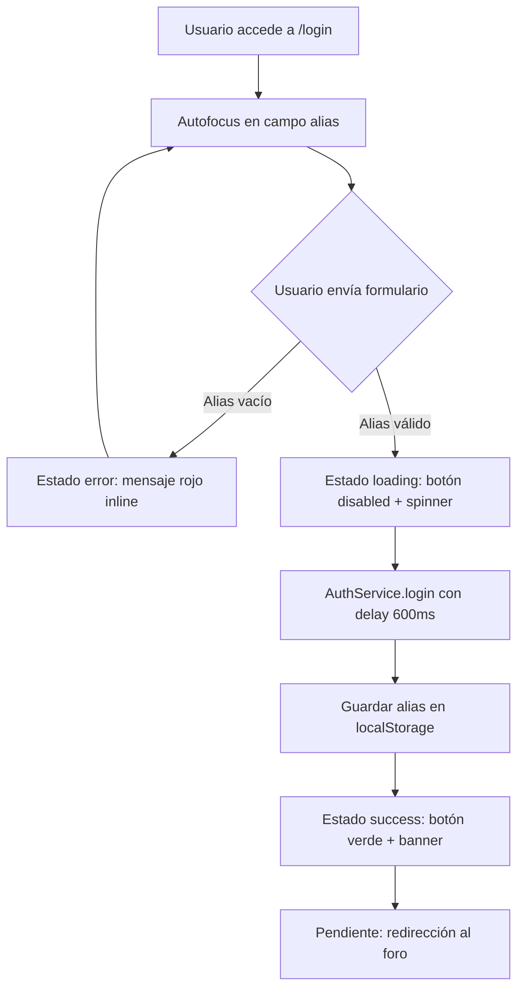
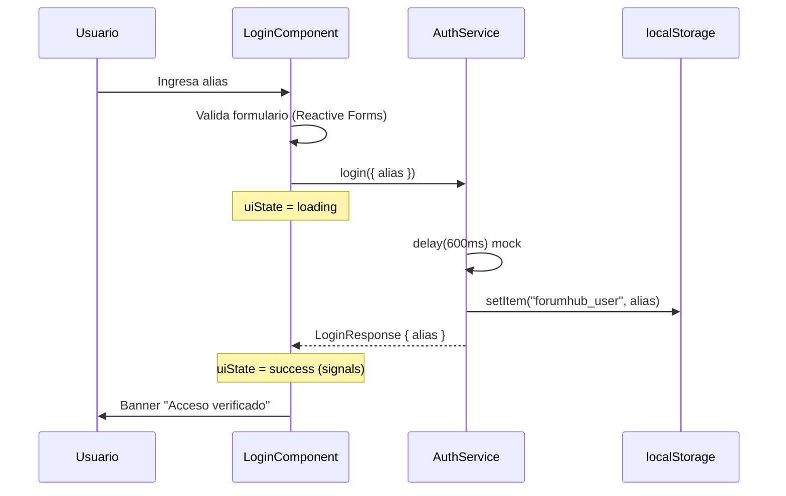

# Documentación — Vista de Login ForumHub

**Commit base:** `74efe1b`  
**Fecha:** 2026-09-13  
**Vista Stitch:** [Vista de Login - Foro de Comentarios](https://stitch.withgoogle.com/projects/5862655047092008036)  
**QA:** Aprobado — ver [`qa-login-resumen.md`](./qa-login-resumen.md)

---

## Resumen de la implementación

Se implementó la vista **"Vista de Login - Foro de Comentarios"** del proyecto Stitch **"Aplicación Foro Comentarios Interactivos"** en Angular 22 con Tailwind CSS 4.

La vista permite el acceso al foro mediante un **alias/nombre de usuario** (sin contraseña), replicando fielmente el diseño de ForumHub v2.0: header sticky, card centrada, formulario de acceso, estados de UI (idle, error, loading, success) y footer con paleta del sistema.

### Stack utilizado

| Tecnología | Versión / Uso |
|------------|---------------|
| Angular | 22.1.x (standalone components) |
| Tailwind CSS | 4.1.x (`@theme` tokens) |
| Phosphor Icons | 2.1.x |
| Reactive Forms | Validación de alias |
| RxJS | AuthService con delay mock |
| Playwright | QA E2E (9/9 pruebas) |

---

## Diagrama de flujo del login



---

## Diagrama de arquitectura



---

## Estructura de archivos creados

```
src/
├── app/
│   ├── core/
│   │   └── services/
│   │       └── auth.service.ts          # Servicio de autenticación (mock)
│   ├── features/
│   │   └── auth/
│   │       └── login/
│   │           ├── login.component.ts     # Lógica + signals + formulario
│   │           └── login.component.html   # Template fiel a Stitch
│   ├── app.routes.ts                      # Ruta /login lazy-loaded
│   ├── app.html                           # Solo <router-outlet />
│   └── app.ts
├── styles.css                             # Tokens Tailwind + Phosphor Icons
e2e/
└── qa-login.spec.ts                       # Suite QA Playwright (9 tests)
documentation/
├── stitch/
│   ├── login-reference.html               # HTML exportado de Stitch
│   └── login-reference.png                # Screenshot de referencia
├── qa-screenshots/                        # Capturas de estados QA
└── qa-login-resumen.md                    # Resumen de pruebas
task/                                      # Tareas 00–09 del proyecto
playwright.config.ts
```

---

## Decisiones técnicas

### 1. Acceso por alias (sin contraseña)

El diseño de Stitch define un login simplificado con un único campo de alias. No se implementaron campos de email/contraseña ni enlaces de recuperación.

### 2. Signals en lugar de propiedades de clase

Angular 22 opera sin Zone.js por defecto. Los callbacks RxJS en `subscribe()` no disparaban change detection. Se migraron `uiState`, `showFieldError` y `welcomeAlias` a **signals** para actualizar la UI reactivamente.

### 3. Tokens de diseño en `@theme`

Los colores de Stitch se centralizaron en `src/styles.css` usando la directiva `@theme` de Tailwind 4:

| Token | Valor | Uso |
|-------|-------|-----|
| `--color-primary` | `#4F9AFF` | Botón, logo, acentos |
| `--color-secondary` | `#5BFF4F` | Éxito, badge online |
| `--color-danger` | `#D60F1C` | Errores de validación |
| `--color-info` | `#14D9E0` | Badge "Portal de Acceso" |
| `--color-warning` | `#EDE702` | Icono "Acceso instantáneo" |
| `--color-bg-main` | `#FCFCFC` | Fondo de página |
| `--color-fg-main` | `#242424` | Texto principal |
| `--color-bg-card` | `#FFFFFF` | Cards, header, footer |

### 4. AuthService con mock

El backend no está conectado aún. `AuthService.login()` simula una petición con `delay(600)` y persiste el alias en `localStorage` bajo la clave `forumhub_user`, igual que el prototipo HTML de Stitch.

### 5. Lazy loading de la ruta

El componente de login se carga bajo demanda con `loadComponent()` para mantener el bundle inicial liviano (~50 KB chunk separado).

### 6. Alias de importación `@src/`

Configurado en `tsconfig.app.json` para cumplir las reglas del proyecto.

---

## Comparativa visual Stitch vs Angular

| Elemento | Stitch | Angular | Estado |
|----------|--------|---------|--------|
| Header sticky con logo y badges | ✅ | ✅ | Idéntico |
| Card centrada con sombra suave | ✅ | ✅ | Idéntico |
| Icono bienvenida + badge check | ✅ | ✅ | Idéntico |
| Input alias con icono `@` | ✅ | ✅ | Idéntico |
| Botón "Acceder al foro" + flecha | ✅ | ✅ | Idéntico |
| Features: sin contraseña / acceso instantáneo | ✅ | ✅ | Idéntico |
| Footer con paleta del sistema | ✅ | ✅ | Idéntico |
| Estado error (mensaje rojo) | ✅ | ✅ | Idéntico |
| Estado loading (spinner) | ✅ | ✅ | Idéntico |
| Estado success (banner verde) | ✅ | ✅ | Idéntico |

### Referencias visuales

- **Stitch:** `documentation/stitch/login-reference.png`
- **Implementación:** `documentation/qa-screenshots/login-comparacion-implementacion.png`
- **Estados QA:** `documentation/qa-screenshots/login-estado-*.png`

---

## Instrucciones de uso y prueba

### Levantar el proyecto

```bash
pnpm dev          # o pnpm start — puerto 4200
```

### Acceder a la vista

```
http://localhost:4200/login
```

### Flujo manual de prueba

1. Abrir `/login` → el campo alias tiene autofocus
2. Clic en "Acceder al foro" sin escribir → aparece error rojo
3. Escribir un alias (ej. `moises_dev`) y enviar
4. El botón muestra "Validando acceso..." durante ~600ms
5. Aparece banner verde "¡Acceso verificado con éxito!"
6. Verificar en DevTools: `localStorage.getItem('forumhub_user')`

### Ejecutar pruebas automatizadas

```bash
pnpm test:e2e
```

### Ejecutar tests unitarios

```bash
pnpm test
```

---

## Próximos pasos

| Tarea | Descripción |
|-------|-------------|
| Conectar backend real | Reemplazar mock en `AuthService` con `HttpClient` |
| AuthGuard | Proteger rutas del foro que requieran sesión |
| Redirección post-login | Navegar a vista de comentarios tras éxito |
| Vista de comentarios | Implementar siguiente pantalla de Stitch |

---

## Referencias

- Proyecto Stitch: https://stitch.withgoogle.com/projects/5862655047092008036
- Análisis de diseño: [`task/00-analisis-vista-login.md`](../task/00-analisis-vista-login.md)
- Resumen QA: [`qa-login-resumen.md`](./qa-login-resumen.md)
- Índice de tareas: [`task/README.md`](../task/README.md)
