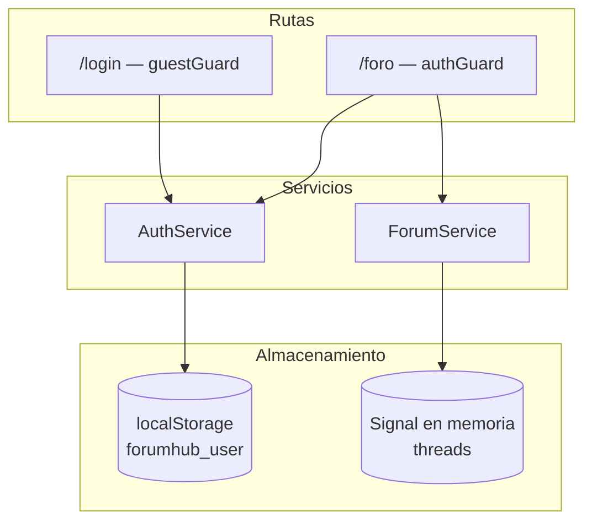
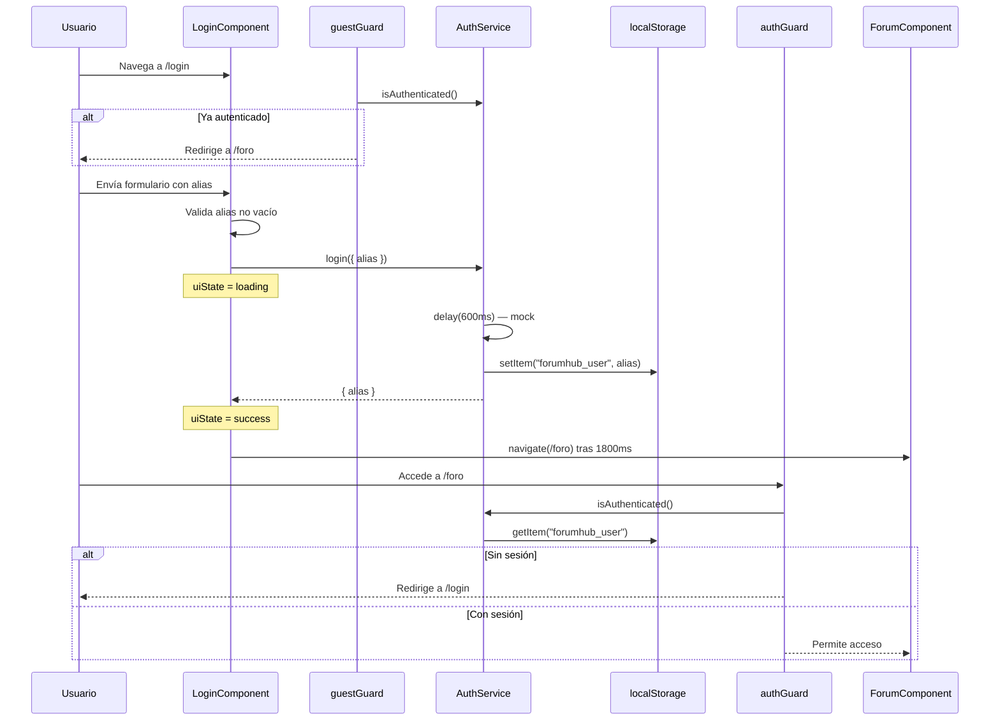
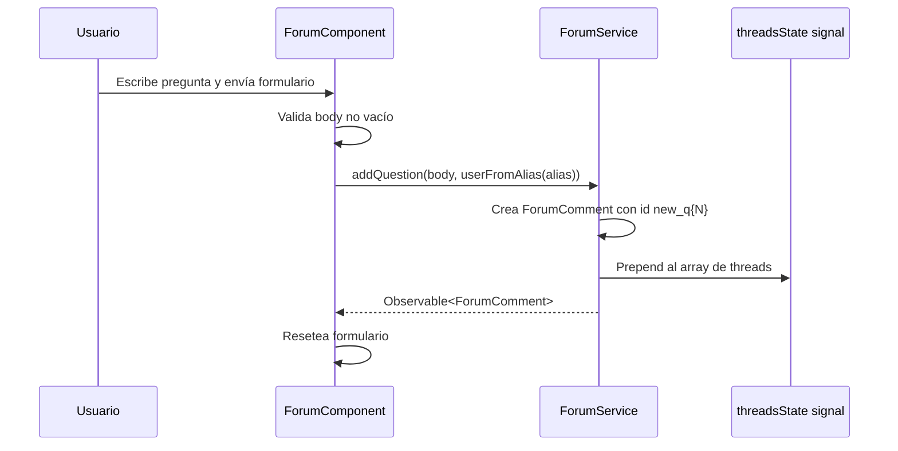
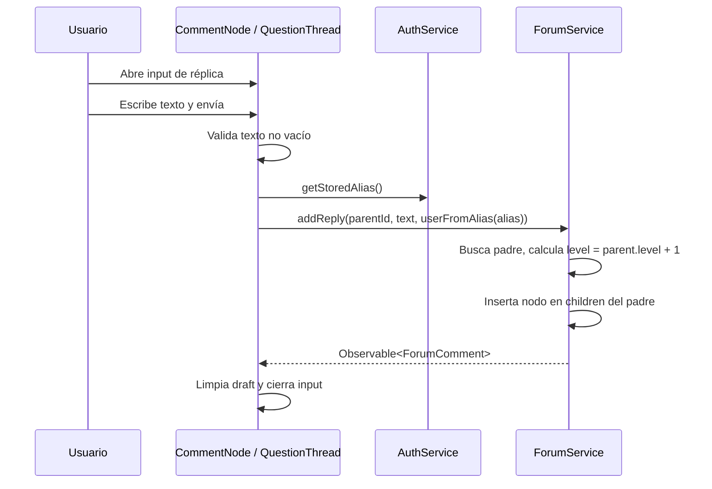
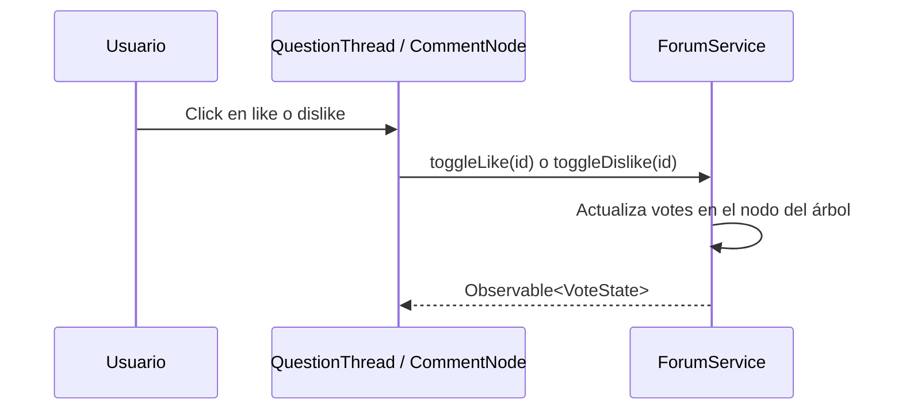

# Documentación — Requests al servicio y flujo del frontend

**Fecha:** 2026-09-13  
**Proyecto:** ForumHub (`foro_frontend`)  
**Propósito:** Describir el flujo que ejecuta actualmente el frontend y los requests HTTP que deberían enviarse al conectar con un backend real.

---

## Resumen

El frontend de ForumHub es una aplicación Angular 22 que implementa dos flujos principales:

1. **Autenticación por alias** — acceso sin contraseña, sesión en `localStorage`.
2. **Foro de preguntas y réplicas** — árbol de comentarios anidados con votos like/dislike mutuamente exclusivos.

Hoy **no se realizan llamadas HTTP reales**. Los servicios `AuthService` y `ForumService` simulan la red con RxJS (`of`, `delay`) y mutan estado en memoria. Este documento describe:

- Qué hace el frontend en cada paso del flujo actual.
- Qué request debería enviarse al backend para replicar ese comportamiento.

---

## Estado actual vs. integración futura

| Aspecto | Estado actual | Integración futura |
|---------|---------------|-------------------|
| Cliente HTTP | No configurado (`provideHttpClient` ausente) | `HttpClient` de Angular |
| Base URL | No definida | Variable de entorno / `environment.ts` |
| Autenticación | Alias en `localStorage` (`forumhub_user`) | JWT en header `Authorization: Bearer <token>` |
| Datos del foro | Signal en memoria con seed canónico | `GET` inicial + mutaciones por acción |
| Errores HTTP | Solo validación local en login | Interceptor + manejo 4xx/5xx |

Los componentes ya consumen los servicios mediante `Observable`, por lo que la integración consiste en reemplazar la implementación interna de `AuthService` y `ForumService` sin cambiar la UI.

---

## Arquitectura de flujo general



---

## Autenticación y sesión

### Flujo actual



### Request esperado: Login

| Campo | Valor |
|-------|-------|
| **Endpoint sugerido** | `POST /auth/login` |
| **Disparado por** | `LoginComponent.onSubmit()` → `AuthService.login()` |
| **Archivo** | `src/app/core/services/auth.service.ts` |

**Request body:**

```json
{
  "alias": "moises_dev"
}
```

**Headers sugeridos:**

```http
Content-Type: application/json
```

**Response exitosa (200):**

```json
{
  "alias": "moises_dev",
  "token": "eyJhbGciOiJIUzI1NiIsInR5cCI6IkpXVCJ9..."
}
```

> El campo `token` es opcional en la interfaz actual (`LoginResponse` solo define `alias`), pero se recomienda incluirlo cuando el backend lo provea.

**Comportamiento del frontend tras la respuesta:**

1. Guarda `alias` en `localStorage` bajo la clave `forumhub_user`.
2. Si el backend devuelve `token`, debería persistirse (p. ej. `forumhub_token`) para enviarlo en requests posteriores.
3. Muestra estado `success` y redirige a `/foro` después de 1800 ms.

**Errores que el frontend debería manejar:**

| Código | Escenario | Comportamiento UI |
|--------|-----------|-------------------|
| `400` | Alias inválido o vacío | `uiState = 'error'`, mensaje inline |
| `409` | Alias ya ocupado | `uiState = 'error'`, mensaje inline |
| `500` | Error del servidor | `uiState = 'error'` |
| Red | Sin conexión | `uiState = 'error'` |

**Validación previa (sin request):** Si el alias está vacío tras `trim()`, el componente muestra error sin llamar al servicio.

### Sesión y guards

| Mecanismo | Detalle |
|-----------|---------|
| **Clave localStorage** | `forumhub_user` |
| **Valor almacenado** | String del alias (texto plano) |
| **Verificación** | `AuthService.isAuthenticated()` — comprueba que exista la clave |
| **authGuard** | Bloquea `/foro` si no hay sesión → redirige a `/login` |
| **guestGuard** | Bloquea `/login` si ya hay sesión → redirige a `/foro` |
| **logout** | `AuthService.logout()` elimina `forumhub_user` — **no está conectado a la UI aún** |

### Request opcional: Logout

| Campo | Valor |
|-------|-------|
| **Endpoint sugerido** | `POST /auth/logout` |
| **Disparado por** | `AuthService.logout()` (cuando se conecte a la UI) |

**Headers sugeridos:**

```http
Authorization: Bearer <token>
```

El frontend eliminaría `forumhub_user` y `forumhub_token` del `localStorage` tras éxito o de forma inmediata en logout local.

---

## Foro — Carga inicial

### Flujo actual

Al entrar a `/foro`, el componente lee directamente el signal `forumService.threads`. **No se ejecuta ningún fetch.** Los datos provienen del hilo canónico sembrado en memoria (`q1` → `r1` → `r1_1` → `r1_1_1`).

El método `ForumService.getThreads()` existe y devuelve `of(threads)`, pero **ningún componente lo invoca**.

### Request esperado: Obtener hilos

| Campo | Valor |
|-------|-------|
| **Endpoint sugerido** | `GET /questions` o `GET /threads` |
| **Disparado por** | Carga de `ForumComponent` (a implementar) |
| **Archivo** | `src/app/core/services/forum.service.ts` |

**Headers sugeridos:**

```http
Authorization: Bearer <token>
```

**Response exitosa (200):**

```json
[
  {
    "id": "q1",
    "parentId": null,
    "author": {
      "displayName": "Carlos Rodríguez",
      "handle": "@carlos_dev",
      "initials": "CR",
      "tone": "author"
    },
    "body": "Estoy implementando un foro con mutaciones optimistas...",
    "createdLabel": "Publicado a las 14:30",
    "relativeLabel": "Hace 2 horas",
    "level": 0,
    "badge": "",
    "origin": "seed",
    "votes": {
      "liked": false,
      "disliked": false,
      "likes": 15,
      "dislikes": 1
    },
    "children": [
      {
        "id": "r1",
        "parentId": "q1",
        "author": { "displayName": "Mariana López", "initials": "ML", "tone": "level1" },
        "body": "Recomiendo separar la capa de mutación optimista...",
        "createdLabel": "hace 1 hora",
        "relativeLabel": "hace 1 hora",
        "level": 1,
        "badge": "Nivel 1",
        "origin": "seed",
        "votes": { "liked": false, "disliked": false, "likes": 9, "dislikes": 1 },
        "children": []
      }
    ]
  }
]
```

> El backend puede devolver la estructura anidada (`children[]`) o una lista plana con `parentId`; el frontend espera árbol anidado. Si el API es plano, se necesitará un mapper en el servicio.

---

## Foro — Publicar pregunta

### Flujo actual



### Request esperado: Nueva pregunta

| Campo | Valor |
|-------|-------|
| **Endpoint sugerido** | `POST /questions` |
| **Disparado por** | `ForumComponent.publishQuestion()` |
| **Archivo** | `src/app/features/forum/forum.component.ts` |

**Request body:**

```json
{
  "body": "¿Cómo estructurar el estado del árbol de comentarios?"
}
```

> El autor se infiere del token de sesión en el backend. El frontend construye `ForumUser` localmente con `userFromAlias()` solo para la UI optimista.

**Headers sugeridos:**

```http
Content-Type: application/json
Authorization: Bearer <token>
```

**Response exitosa (201):**

```json
{
  "id": "new_q2",
  "parentId": null,
  "author": {
    "displayName": "moises_dev",
    "handle": "@moises_dev",
    "initials": "MO",
    "tone": "current"
  },
  "body": "¿Cómo estructurar el estado del árbol de comentarios?",
  "createdLabel": "recién publicado",
  "relativeLabel": "recién publicado",
  "level": 0,
  "badge": "Nueva pregunta",
  "origin": "user",
  "votes": { "liked": false, "disliked": false, "likes": 0, "dislikes": 0 },
  "children": []
}
```

**Comportamiento actual del mock:** La nueva pregunta se inserta al inicio del listado (`[question, ...threads]`), no reemplaza `q1`.

---

## Foro — Publicar réplica

### Flujo actual

Las réplicas se publican desde dos componentes según el nivel del nodo:

| Componente | Contexto | `parentId` |
|------------|----------|------------|
| `QuestionThreadComponent` | Respuesta directa a una pregunta | `thread().id` |
| `CommentNodeComponent` | Sub-réplica a cualquier comentario | `comment().id` |



### Request esperado: Nueva réplica

| Campo | Valor |
|-------|-------|
| **Endpoint sugerido** | `POST /comments` o `POST /questions/:parentId/replies` |
| **Disparado por** | `QuestionThreadComponent.submitReply()` / `CommentNodeComponent.submitReply()` |

**Request body:**

```json
{
  "parentId": "r1",
  "body": "Totalmente de acuerdo, parentId es clave para el árbol."
}
```

**Headers sugeridos:**

```http
Content-Type: application/json
Authorization: Bearer <token>
```

**Response exitosa (201):**

```json
{
  "id": "new_r4",
  "parentId": "r1",
  "author": {
    "displayName": "moises_dev",
    "handle": "@moises_dev",
    "initials": "MO",
    "tone": "current"
  },
  "body": "Totalmente de acuerdo, parentId es clave para el árbol.",
  "createdLabel": "recién publicado",
  "relativeLabel": "recién publicado",
  "level": 2,
  "badge": "Sub-réplica escalonada",
  "origin": "user",
  "votes": { "liked": false, "disliked": false, "likes": 0, "dislikes": 0 },
  "children": []
}
```

**Reglas de negocio (implementadas en el mock):**

- `level` = `parent.level + 1`
- Badge `"Respuesta directa"` si el padre es pregunta raíz (`parent.parentId === null`)
- Badge `"Sub-réplica escalonada"` en cualquier otro caso
- Si el padre no existe, el mock devuelve el primer thread sin error (fallback silencioso — el backend debería responder `404`)

---

## Foro — Votos (like / dislike)

### Flujo actual

Los votos se aplican de forma **optimista e inmediata** en memoria. No hay delay simulado.



**Reglas de toggle (mutuamente exclusivos):**

| Acción | Efecto |
|--------|--------|
| Like cuando no está activo | `liked: true`, incrementa `likes`; si había dislike, lo quita y decrementa `dislikes` |
| Like cuando ya está activo | Quita el like, decrementa `likes` |
| Dislike cuando no está activo | `disliked: true`, incrementa `dislikes`; si había like, lo quita y decrementa `likes` |
| Dislike cuando ya está activo | Quita el dislike, decrementa `dislikes` |

### Request esperado: Votar

| Campo | Valor |
|-------|-------|
| **Endpoint sugerido** | `POST /comments/:id/vote` o `PATCH /comments/:id/vote` |
| **Disparado por** | `toggleLike()` / `toggleDislike()` en `QuestionThreadComponent` y `CommentNodeComponent` |

**Request body (like):**

```json
{
  "type": "like"
}
```

**Request body (dislike):**

```json
{
  "type": "dislike"
}
```

**Headers sugeridos:**

```http
Content-Type: application/json
Authorization: Bearer <token>
```

**Response exitosa (200):**

```json
{
  "liked": true,
  "disliked": false,
  "likes": 16,
  "dislikes": 1
}
```

> Alternativa: un único endpoint `PUT /comments/:id/vote` con toggle implícito según el estado actual del usuario.

---

## Modelos de datos

Definidos en `src/app/core/models/forum.model.ts`. El backend debería ser compatible con estas estructuras.

### ForumUser

```typescript
interface ForumUser {
  displayName: string;
  handle?: string;
  initials: string;
  tone: 'author' | 'level1' | 'level2' | 'level3' | 'current';
}
```

El frontend genera `initials`, `handle` y `tone: 'current'` a partir del alias con `userFromAlias()`. El backend puede devolver estos campos calculados.

### VoteState

```typescript
interface VoteState {
  liked: boolean;      // voto del usuario actual
  disliked: boolean;   // voto del usuario actual
  likes: number;       // total de likes
  dislikes: number;    // total de dislikes
}
```

### ForumComment

```typescript
interface ForumComment {
  id: string;
  parentId: string | null;
  author: ForumUser;
  body: string;
  createdLabel: string;    // etiqueta de fecha formateada
  relativeLabel: string;   // etiqueta relativa ("hace 1 hora")
  level: number;           // 0 = pregunta raíz
  badge: string;
  origin: 'seed' | 'user';
  votes: VoteState;
  children: ForumComment[];
}
```

### LoginRequest / LoginResponse

```typescript
interface LoginRequest {
  alias: string;
}

interface LoginResponse {
  alias: string;
  token?: string;
}
```

---

## Tabla resumen de endpoints

| Acción del usuario | Servicio actual | Método | Endpoint sugerido | Auth |
|--------------------|-----------------|--------|-------------------|------|
| Iniciar sesión | `AuthService.login` | `POST` | `/auth/login` | No |
| Cerrar sesión | `AuthService.logout` | `POST` | `/auth/logout` | Sí |
| Cargar foro | `ForumService.threads` (signal) | `GET` | `/questions` | Sí |
| Publicar pregunta | `ForumService.addQuestion` | `POST` | `/questions` | Sí |
| Publicar réplica | `ForumService.addReply` | `POST` | `/comments` | Sí |
| Like | `ForumService.toggleLike` | `POST` | `/comments/:id/vote` | Sí |
| Dislike | `ForumService.toggleDislike` | `POST` | `/comments/:id/vote` | Sí |

---

## Rutas del frontend

| Ruta | Guard | Componente | Requests asociados |
|------|-------|------------|-------------------|
| `/login` | `guestGuard` | `LoginComponent` | `POST /auth/login` |
| `/foro` | `authGuard` | `ForumComponent` | `GET /questions`, `POST /questions`, réplicas, votos |
| `/` | — | Redirige a `/login` | — |
| `/**` | — | Redirige a `/login` | — |

La verificación de sesión en los guards es **local** (`localStorage`). No se envía request al backend para validar el token en cada navegación.

---

## Infraestructura pendiente para conectar el backend

Para que los requests descritos se envíen realmente, el proyecto necesita:

1. **Agregar `@angular/common/http`** y registrar `provideHttpClient()` en `app.config.ts`.
2. **Configurar base URL** del API (p. ej. `https://api.forumhub.local/v1`).
3. **Interceptor de autenticación** que adjunte `Authorization: Bearer <token>` en cada request protegido.
4. **Interceptor de errores** para manejar 401 (redirigir a login), 4xx y 5xx.
5. **Reemplazar mocks** en `AuthService.login` y métodos de `ForumService` por llamadas `HttpClient`.
6. **Carga inicial** — invocar `getThreads()` (o equivalente HTTP) en `ForumComponent.ngOnInit()`.

---

## Archivos de referencia

| Archivo | Responsabilidad |
|---------|-----------------|
| `src/app/core/services/auth.service.ts` | Login mock, sesión en localStorage |
| `src/app/core/services/forum.service.ts` | CRUD mock de preguntas, réplicas y votos |
| `src/app/core/models/forum.model.ts` | Tipos y helpers del árbol |
| `src/app/core/guards/auth.guard.ts` | Protección de `/foro` |
| `src/app/core/guards/guest.guard.ts` | Redirección desde `/login` |
| `src/app/features/auth/login/login.component.ts` | UI y flujo de login |
| `src/app/features/forum/forum.component.ts` | Listado y nueva pregunta |
| `src/app/features/forum/question-thread/question-thread.component.ts` | Réplicas y votos en preguntas |
| `src/app/features/forum/comment-node/comment-node.component.ts` | Réplicas y votos en comentarios |
