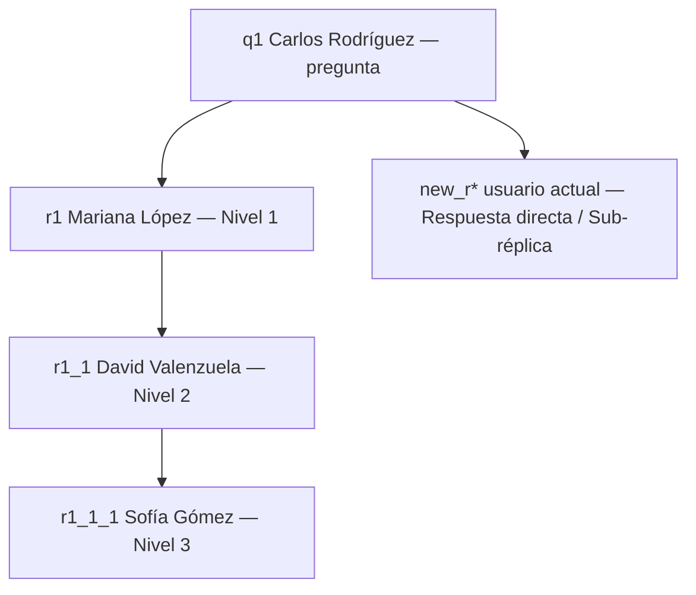
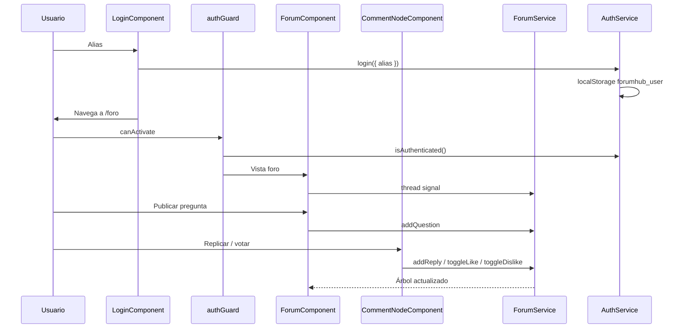

# Documentación — Vista de Comentarios y Discusión ForumHub

**Commit base:** `7552e03` (login)  
**Fecha:** 2026-09-13  
**Vista Stitch:** [Vista de Comentarios y Discusión - ForumHub](https://stitch.withgoogle.com/projects/5862655047092008036)  
**QA:** Aprobado — ver [`qa-comentarios-resumen.md`](./qa-comentarios-resumen.md)

---

## Resumen de la implementación

Se implementó la vista **"Vista de Comentarios y Discusión - ForumHub"** del proyecto Stitch **"Aplicación Foro Comentarios Interactivos"** en Angular 22 con Tailwind CSS 4.

Tras el acceso por alias, el usuario entra a `/foro` (ruta protegida). La vista replica el diseño de ForumHub: header autenticado, card para publicar una pregunta, hilo con réplicas en escalera (`parentId`) y votos me gusta / no me gusta mutuamente exclusivos.

### Stack utilizado

| Tecnología | Versión / Uso |
|------------|---------------|
| Angular | 22.1.x (standalone, signals, functional guards) |
| Tailwind CSS | 4.1.x (`@theme` tokens + utilidades de hilo) |
| Phosphor Icons | 2.1.x |
| Reactive Forms | Textarea de nueva pregunta |
| RxJS | `ForumService` mock en memoria |
| Playwright | QA E2E (23/23 en la suite) |

---

## Diagrama de flujo

```mermaid
flowchart TD
    A[Usuario en /login] --> B{¿Alias válido?}
    B -->|No| C[Error inline]
    C --> A
    B -->|Sí| D[Banner éxito]
    D --> E[/foro con authGuard]
    E --> F{Acción}
    F -->|Publicar pregunta| G[Reemplaza cuerpo de q1 y resetea votos]
    F -->|Replicar| H[Muestra input agregar replica]
    H --> I{Texto vacío?}
    I -->|Sí| J[Focus, no inserta]
    I -->|No| K[Nodo hijo + oculta input]
    F -->|Like / Dislike| L[Toggle mutuamente exclusivo]
```

---

## Diagrama del árbol



---

## Diagrama de arquitectura



---

## Estructura de archivos creados

```
src/app/
├── core/
│   ├── guards/
│   │   ├── auth.guard.ts
│   │   └── guest.guard.ts
│   ├── models/
│   │   └── forum.model.ts
│   └── services/
│       ├── auth.service.ts
│       └── forum.service.ts
└── features/
    ├── auth/login/
    └── forum/
        ├── forum.component.ts
        ├── forum.component.html
        └── comment-node/
            ├── comment-node.component.ts
            └── comment-node.component.html
```

---

## Decisiones técnicas

- **Ruta protegida:** `authGuard` exige `forumhub_user`. `guestGuard` evita volver al login con sesión activa.
- **Redirección post-login:** 1800 ms después del banner de éxito, para no romper las pruebas visuales del login.
- **Seed canónico:** el HTML de Stitch traía texto de prototipo (`sadasdasd…`). Se usa el hilo Carlos → Mariana → David → Sofía.
- **Árbol recursivo:** `CommentNodeComponent` se importa a sí mismo y renderiza `children`.
- **Votos en el servicio:** like y dislike no pueden estar activos a la vez; los contadores viven en `VoteState`.
- **Signals:** el hilo es un `signal` en `ForumService` para que Angular 22 sin Zone.js actualice la UI.

---

## Comparativa visual Stitch vs Angular

| Zona | Stitch | Angular |
|------|--------|---------|
| Header | ForumHub + Comunidad Activa + alias | Igual, alias desde `localStorage` |
| Card pregunta | `#text-question`, `#add_question` | IDs conservados |
| Hilo | 3 niveles + líneas `#E2E8F0` | Igual, sin réplicas de prototipo |
| Votos | Clases `like-active` / `dislike-active` | Igual |
| Footer | Paleta + reglas activas | Igual |

---

## Instrucciones de uso

1. Abrir `http://localhost:4200/login`
2. Ingresar un alias y esperar el acceso
3. En `/foro`, publicar una pregunta, replicar en cualquier nivel y votar

```bash
pnpm test:e2e
```
