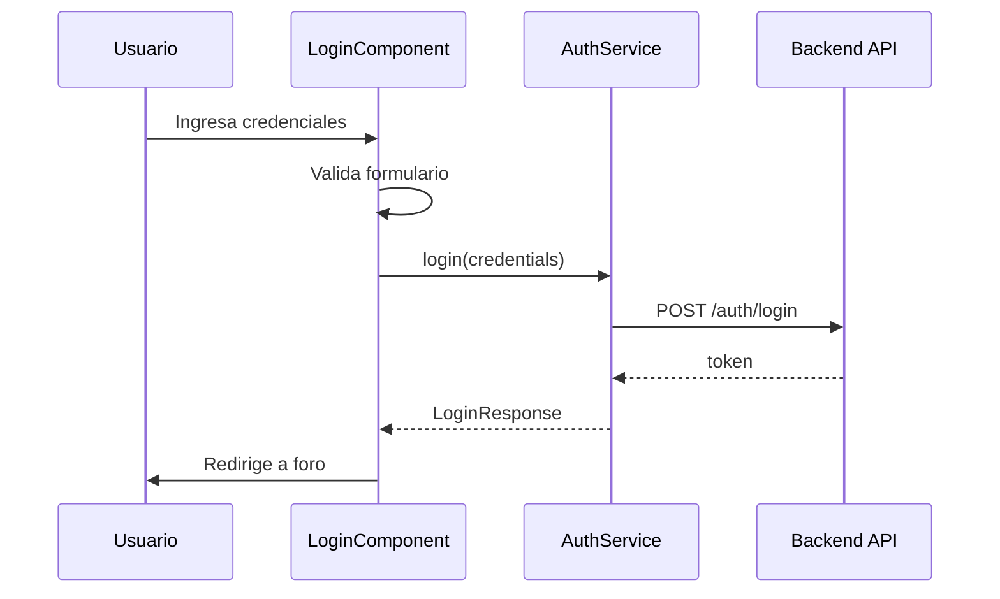

# 09 — Documentación del login

**Dificultad:** Baja  
**Estado:** Completado  
**Dependencias:** 08

## Objetivo

Documentar la implementación de la vista de login tras pasar las pruebas QA satisfactoriamente.

## Tareas

- [x] Crear documento en `documentation/{idCommit}_{fecha}.md`
- [x] Incluir:
  - Resumen de la implementación
  - Diagrama de flujo del login (mermaid)
  - Estructura de archivos creados
  - Decisiones técnicas tomadas
  - Comparativa visual Stitch vs Angular
  - Instrucciones de uso/prueba
- [ ] Diagrama de arquitectura:

## Criterios de aceptación

- [x] Documentación solo se crea tras QA exitoso (regla del proyecto)
- [x] Incluye diagramas explicativos
- [x] Referencia al diseño original en Stitch
- [x] Formato: `{idCommit}_{fecha}.md` → `documentation/74efe1b_2026-09-13.md`
