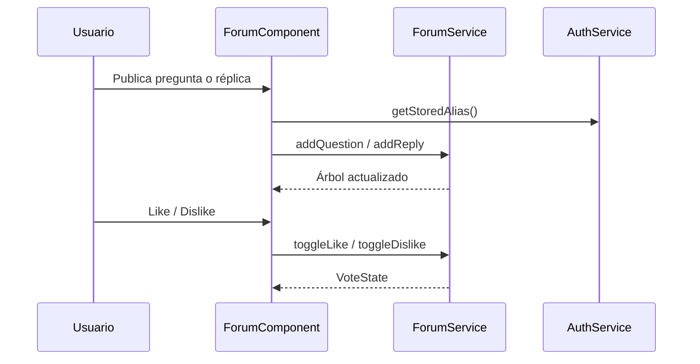

# 20 — Documentación del foro

**Dificultad:** Baja  
**Estado:** Completado  
**Dependencias:** 19

## Objetivo

Documentar la implementación de la vista de comentarios tras pasar las pruebas QA satisfactoriamente.

## Tareas

- [ ] Crear documento en `documentation/{idCommit}_{fecha}.md`
- [ ] Incluir:
  - Resumen de la implementación
  - Diagrama de flujo publicar pregunta / réplica / voto (mermaid)
  - Diagrama del árbol `parentId` (mermaid)
  - Estructura de archivos creados
  - Decisiones técnicas (seed canónico vs HTML contaminado, votos en el servicio, componente recursivo)
  - Comparativa visual Stitch vs Angular
  - Instrucciones de uso/prueba
- [ ] Diagrama de secuencia sugerido:

## Criterios de aceptación

- [ ] Documentación solo se crea tras QA exitoso (regla del proyecto)
- [ ] Incluye diagramas explicativos
- [ ] Referencia al diseño original en Stitch
- [ ] Formato: `{idCommit}_{fecha}.md`
